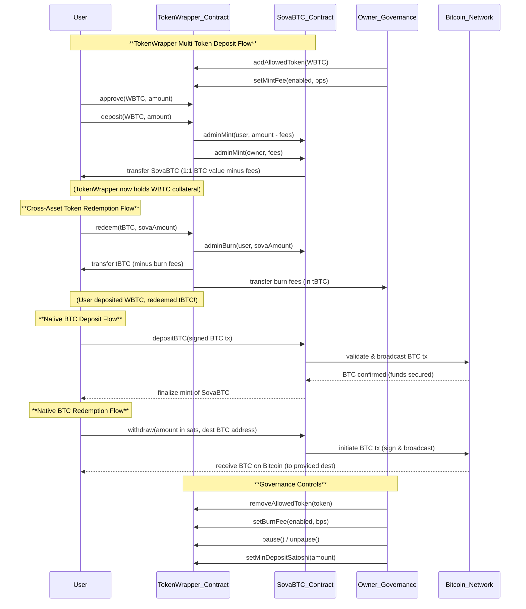

# Sova Contracts

This repository contains the predeploy contracts for the Sova Network.

The Sova Network enables smart contract to directly interact with the Bitcoin blockchain. This interaction is done through the use of custom precompiles and predeployed contracts. This feature set allows smart contract to do things like broadcast transactions, decode payloads, verify signatures, get block height and more!

## Details

The Sova precompiles provide built-in Bitcoin transaction validation, broadcast capabilities, and UTXO management with safeguards against double-spending and replay attacks. These features power the SovaBTC.sol predeploy contract and are available to any developer through the SovaBitcoin.sol library. Our goal is to make it as easy as possible to add native Bitcoin functionality to your Sova smart contracts.

## Contracts
- **SovaL1Block** (`0x2100000000000000000000000000000000000015`) - Bitcoin state tracking
- **SovaBTC** (`0x2100000000000000000000000000000000000020`) - Bitcoin-backed ERC20 token
- **SovaBitcoin** - Library for Bitcoin precompile interactions
- **UBTC20** - Abstract base contract extending ERC20 with pending transaction states and slot locking. Prevents transfers during pending Bitcoin operations and handles deferred accounting for cross-chain finalization.

## Build

```shell
# Build the project
forge build
```

## Deployed Bytecode verification

Generate the deployed byte code locally to verify the predeploy contract code used on the Sova Network.

```shell
# uBTC.sol
forge inspect src/UBTC.sol:UBTC deployedBytecode

# SovaL1Block.sol
forge inspect src/SovaL1Block.sol:SovaL1Block deployedBytecode
```

## TokenWrapper – Universal BTC Wrapper for Sova

`TokenWrapper` allows users to wrap various BTC-pegged ERC20 tokens into a single unified token – **sovaBTC**. The contract maintains a 1:1 BTC backing and enables cross-asset swaps between supported wrapped BTC tokens.

### System Flow Diagram



This sequence diagram illustrates the complete SovaBTC ecosystem, showing both the TokenWrapper's multi-token functionality and the native Bitcoin integration that makes Sova unique.

### Key Features
- **Multi-token support:** deposit or redeem any allowed BTC-pegged ERC20 (WBTC, tBTC, etc.).
- **1:1 conversions:** every sovaBTC is backed by exactly one Bitcoin's worth of the underlying token.
- **Cross-asset conversion:** deposit one wrapped BTC token and redeem another when available.
- **Governance controlled allowlist:** only tokens approved by the owner can be deposited.
- **Configurable fee system:** optional mint and burn fees controlled by governance.
- **Upgradeable & pausable:** the contract uses the UUPS proxy pattern and can be paused in emergencies.
- **Reentrancy protection:** all user-facing functions are protected against reentrancy attacks.

### Supported Tokens
Supported tokens are managed by the owner via an allowlist:
- `addAllowedToken(address token)` – add a new wrapped BTC token.
- `removeAllowedToken(address token)` – remove a token (future deposits blocked; existing reserves remain redeemable).

Any ERC20 representing BTC can be added, e.g. WBTC (8 decimals) or tBTC v2 (18 decimals). The wrapper handles decimal differences so that sovaBTC always has 8 decimals.

### Fee System
The contract implements an optional fee system for both deposits and redemptions:

#### Mint Fees
- Applied when users deposit tokens to receive sovaBTC
- Configurable via `setMintFee(bool enabled, uint256 bps)`
- Fees are collected in sovaBTC and sent to the contract owner
- Users receive `depositAmount - feeAmount` of sovaBTC

#### Burn Fees  
- Applied when users redeem sovaBTC for underlying tokens
- Configurable via `setBurnFee(bool enabled, uint256 bps)`
- Fees are collected in the underlying token and sent to the contract owner
- Users receive `redeemAmount - feeAmount` of the underlying token

Fees are specified in basis points (bps) where 10,000 bps = 100%.

### Deposit Flow
1. Approve the TokenWrapper to spend your BTC token.
2. Call `deposit(token, amount)` with an allowed token address and amount.
3. The contract locks your tokens and mints the BTC-equivalent amount of sovaBTC to you (minus any applicable mint fees).

### Redeem Flow
1. Hold sovaBTC and decide which underlying token you want back.
2. Call `redeem(token, sovaAmount)` specifying the token and amount of sovaBTC to burn.
3. The contract burns your sovaBTC and transfers the chosen BTC token from its reserves to you (minus any applicable burn fees).

### Governance Functions
- `addAllowedToken(address token)` – add a token to the allowlist
- `removeAllowedToken(address token)` – remove a token from the allowlist
- `setMinDepositSatoshi(uint256 minSats)` – set minimum deposit (default 10,000 sats)
- `setMintFee(bool enabled, uint256 bps)` – configure mint fees
- `setBurnFee(bool enabled, uint256 bps)` – configure burn fees
- `pause()` / `unpause()` – emergency stop for deposits and redeems

### Contract Function List
- `initialize(address sovaBTC)` – UUPS initializer.
- `deposit(address token, uint256 amount)` – wrap an allowed token into sovaBTC.
- `redeem(address token, uint256 sovaAmount)` – unwrap sovaBTC for a chosen token.
- `addAllowedToken(address token)` – owner only.
- `removeAllowedToken(address token)` – owner only.
- `setMinDepositSatoshi(uint256 minSats)` – owner only.
- `setMintFee(bool enabled, uint256 bps)` – owner only.
- `setBurnFee(bool enabled, uint256 bps)` – owner only.
- `pause()` / `unpause()` – owner only.
- `owner()` – from `OwnableUpgradeable`.

### Events
The contract emits the following events for tracking:
- `TokenWrapped(address indexed user, address indexed token, uint256 amountIn, uint256 sovaAmount)` – emitted on successful deposits
- `TokenUnwrapped(address indexed user, address indexed token, uint256 amountOut, uint256 sovaAmount)` – emitted on successful redemptions
- `AllowedTokenAdded(address indexed token)` – emitted when a token is added to allowlist
- `AllowedTokenRemoved(address indexed token)` – emitted when a token is removed from allowlist
- `MintFeeUpdated(bool enabled, uint256 bps)` – emitted when mint fees are updated
- `BurnFeeUpdated(bool enabled, uint256 bps)` – emitted when burn fees are updated

### Error Handling
The contract includes comprehensive error handling with custom errors:
- `TokenNotAllowed(address token)` – attempted deposit of non-allowlisted token
- `DepositBelowMinimum(uint256 amount, uint256 minimum)` – deposit amount below minimum threshold
- `InsufficientReserve(address token, uint256 requested, uint256 available)` – insufficient token reserves for redemption
- `AlreadyAllowed(address token)` – trying to add a token that's already allowlisted
- `NotInAllowlist(address token)` – trying to remove a token that's not allowlisted
- `ZeroAddress()` – invalid zero address provided
- `ZeroAmount()` – invalid zero amount provided

### Security Considerations
- The total supply of sovaBTC is always backed by the BTC-value of tokens held by the contract.
- Deposits that would result in fractional satoshis are rejected to avoid rounding issues.
- Only the owner can manage the allowlist, configure fees, or pause the contract.
- The UUPS upgrade pattern allows the contract logic to be upgraded if required.
- All user-facing functions include reentrancy protection.
- Fee collection ensures the owner can monetize the service while maintaining full transparency.

### Running Tests
This repository uses Foundry for testing. Run all tests with:

```shell
forge test -vvv
```

### Deployment
The `DeployTokenWrapper.s.sol` script deploys and initializes the wrapper via a UUPS proxy.

```shell
forge script script/DeployTokenWrapper.s.sol --broadcast \
    --rpc-url <RPC_URL> --private-key $PRIVATE_KEY
```

Ensure the environment variable `PRIVATE_KEY` is set to the deployer key. The script deploys the implementation and proxy, initializes it with the predeployed `SovaBTC` address (`0x2100000000000000000000000000000000000020`), and transfers ownership of `SovaBTC` to the wrapper so it can mint and burn on deposits and redeems.
