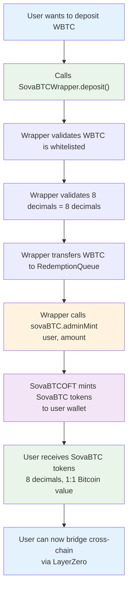
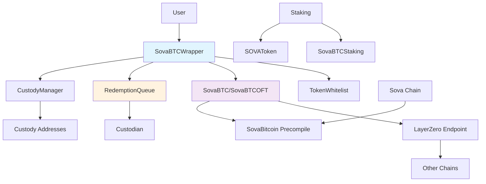

# SovaBTC - Multi-Chain Bitcoin-Backed Token Protocol

[](https://github.com/SovaNetwork/contracts)
[](https://github.com/SovaNetwork/contracts)
[](LICENSE)

SovaBTC is a comprehensive, multi-chain Bitcoin-backed token protocol that enables seamless Bitcoin interactions across different blockchain networks. Built with LayerZero's Omnichain Fungible Token (OFT) standard, it provides secure custody management, queued redemptions, and yield-generating staking capabilities.

## 🔑 **How It Works - Simple Overview**

**For Users:**
1. **Deposit**: Send WBTC/USDC to `SovaBTCWrapper` → Get SovaBTC tokens
2. **Bridge**: Send SovaBTC cross-chain via LayerZero (burns/mints automatically)
3. **Redeem**: Queue redemption → Wait 10 days → Custodian fulfills → Get original tokens back

**For Developers:**
- `SovaBTCWrapper` = User interface for deposits/redemptions
- `SovaBTCOFT` = LayerZero OFT token contract (actual SovaBTC token)
- Integration via `ISovaBTC` interface: `wrapper.deposit()` → `sovaBTC.adminMint()`

**Key Insight**: The wrapper doesn't import the OFT contract directly. Instead, it uses the `ISovaBTC` interface to call `adminMint()` on the OFT contract, which mints SovaBTC tokens to users.

## 🌟 Key Features

### 🔗 Multi-Chain Compatibility
- **LayerZero OFT Integration**: Seamless cross-chain Bitcoin transfers
- **Unified Supply Management**: Consistent total supply across all chains
- **Cross-Chain Messaging**: Secure burn/mint operations via LayerZero

### 🏦 Advanced Custody & Security
- **Multi-Signature Custody**: Configurable custody addresses for enhanced security
- **Role-Based Access Control**: Granular permissions for different operations
- **Emergency Controls**: Pause functionality and emergency token recovery
- **Queued Redemptions**: Configurable time delays for large redemptions

### 💰 Multi-Token Support
- **Token Whitelist Management**: Support for various BTC-pegged tokens (WBTC, USDC, etc.)
- **Automatic Decimal Conversion**: Seamless handling of tokens with different decimal places
- **Reserve Validation**: Real-time reserve checking for redemptions

### 🚀 Yield Generation
- **SovaBTC Staking**: Earn SOVA tokens by staking SovaBTC
- **SOVA Revenue Sharing**: Stake SOVA tokens to earn protocol revenue
- **Flexible Lock Periods**: Enhanced rewards for longer staking commitments

### ⚡ Direct Bitcoin Integration (Sova Chain)
- **Native Bitcoin Transactions**: Direct Bitcoin withdrawal via precompile
- **Immediate Settlement**: No queue delays for Bitcoin redemptions on Sova chain
- **Bitcoin Address Conversion**: Automatic address format handling

## 🏗️ Architecture Overview

### How the Contracts Work Together

SovaBTC uses a **two-contract system** that seamlessly integrates to provide both multi-token deposits and cross-chain functionality:

#### 1. **SovaBTCOFT** - The Token Contract
- **LayerZero OFT**: Omnichain Fungible Token for cross-chain transfers
- **ISovaBTC Interface**: Implements the standard interface for minting/burning
- **Minter Authorization**: Only authorized contracts (like the wrapper) can mint tokens
- **8 Decimals**: Bitcoin-compatible precision

#### 2. **SovaBTCWrapper** - The User Interface
- **Multi-Token Deposits**: Accept WBTC, USDC, and other whitelisted tokens
- **Automatic Minting**: Calls `SovaBTCOFT.adminMint()` to create SovaBTC tokens
- **Reserve Management**: Transfers deposited tokens to RedemptionQueue
- **Decimal Conversion**: Handles different token decimals automatically

#### 3. **The Complete User Flow**



**Example: Depositing 1 WBTC**
1. User calls `SovaBTCWrapper.deposit(wbtcAddress, 1e8)` (1 WBTC - 8 decimals)
2. Wrapper validates: WBTC has 8 decimals, same as SovaBTC
3. Wrapper calls `sovaBTC.adminMint(user, 1e8)` (1 SovaBTC)
4. SovaBTCOFT mints 1 SovaBTC to user
5. User receives 1 SovaBTC (8 decimals) = 1 Bitcoin worth

#### 4. **Critical Integration Points**

**During Deployment:**
```solidity
// 1. Deploy SovaBTCOFT
SovaBTCOFT sovaBTC = new SovaBTCOFT("SovaBTC", "SOVA", lzEndpoint, owner);

// 2. Deploy SovaBTCWrapper with SovaBTCOFT address
SovaBTCWrapper wrapper = new SovaBTCWrapper(
    address(sovaBTC),  // ← SovaBTCOFT address
    tokenWhitelist,
    custodyManager,
    minDeposit
);

// 3. Authorize wrapper as minter
sovaBTC.addMinter(address(wrapper));  // ← Critical step!

// 4. Set RedemptionQueue on wrapper
wrapper.setRedemptionQueue(address(redemptionQueue));
```



**Key Relationships:**
- `SovaBTCWrapper` → `SovaBTCOFT` (via `ISovaBTC` interface)
- `SovaBTCWrapper` → `RedemptionQueue` (for reserves)
- `SovaBTCWrapper` → `TokenWhitelist` (for validation)
- `SovaBTCOFT` → `LayerZero` (for cross-chain transfers)

## 📚 **Key Documentation**

For detailed deployment information and contract addresses, see:
- **[docs/deployment/](./docs/deployment/)** - Network deployments and contract addresses
- **[docs/ui/](./docs/ui/)** - Frontend development guides

## 📋 Contract Overview

### Core Contracts

| Contract | Description | Key Features |
|----------|-------------|--------------|
| **`SovaBTCOFT.sol`** | 🌐 LayerZero OFT token contract | Cross-chain transfers, minting/burning, 8 decimals |
| **`SovaBTCWrapper.sol`** | 🎯 Main user interface | Multi-token deposits, automatic minting, reserve management |
| `TokenWhitelist.sol` | ✅ Approved token management | Add/remove tokens, decimal handling |
| `RedemptionQueue.sol` | ⏰ Queued redemption system | Time delays, reserve validation, batch processing |
| `CustodyManager.sol` | 🔒 Security and custody controls | Role management, destination validation |

### Contract Integration Flow

```solidity
// User deposits WBTC to get SovaBTC
function deposit(address token, uint256 amount) external {
    // 1. Validate token is whitelisted
    require(tokenWhitelist.isTokenAllowed(token), "Token not allowed");
    
    // 2. Convert to 8 decimals (Bitcoin precision)
    uint256 sovaAmount = convertToSovaBTCAmount(amount);
    
    // 3. Transfer WBTC to reserves
    IERC20(token).transferFrom(msg.sender, address(redemptionQueue), amount);
    
    // 4. Mint SovaBTC tokens to user
    sovaBTC.adminMint(msg.sender, sovaAmount);  // ← Key integration!
}
```

**Critical Setup Requirements:**
1. **Minter Authorization**: `SovaBTCWrapper` must be added as minter on `SovaBTCOFT`
2. **Interface Compatibility**: `SovaBTCOFT` implements `ISovaBTC` for wrapper integration
3. **Reserve Management**: `RedemptionQueue` must be set on wrapper for proper reserves

### Staking System

| Contract | Description | Key Features |
|----------|-------------|--------------|
| `SovaBTCStaking.sol` | SovaBTC staking contract | Stake SovaBTC, earn SOVA rewards |
| `SOVAToken.sol` | Protocol governance token | Minting controls, revenue sharing |

## 🧪 Testing & Coverage

Our comprehensive test suite ensures robust functionality across all components:

- **📊 Test Coverage**: 99.84% lines (1286/1288), 99.68% statements (1259/1263), 99.66% branches (289/290), 100% functions (296/296)
- **✅ Test Results**: 838/838 tests passing (100% success rate)
- **🏆 Achievement**: Near-perfect coverage across 41 test suites with enterprise-grade validation
  - **🔍 Test Categories**:
    - Unit tests for all contracts (100% function coverage)
    - Integration tests for cross-contract interactions
    - Edge case and boundary testing
    - Security and access control testing
    - Cross-chain functionality testing
    - Malicious token interaction testing
    - Comprehensive coverage testing (targeting specific missing branches)
    - Fuzz testing for mathematical operations
    - Precompile failure simulation testing

### Running Tests

```bash
# Run all tests
forge test

# Run tests with coverage
forge coverage

# Run specific test file
forge test --match-path test/RedemptionQueue_Coverage.t.sol

# Run tests with gas reporting
forge test --gas-report
```

## 🚀 Quick Start

### Prerequisites

- [Foundry](https://book.getfoundry.sh/getting-started/installation)
- Node.js 16+
- Git

### Installation

```bash
# Clone the repository
git clone https://github.com/your-repo/contracts.git
cd contracts

# Install dependencies
forge install

# Build contracts
forge build

# Run tests
forge test
```

### Deployment & Setup

#### 1. Deploy Core Contracts (Proper Order)

```bash
# Deploy all contracts in correct order with proper integration
forge script script/DeployOFTComplete.s.sol --rpc-url $RPC_URL --broadcast

# This script handles:
# - Deploying SovaBTCOFT with LayerZero integration
# - Deploying SovaBTCWrapper with SovaBTCOFT address
# - Adding wrapper as authorized minter
# - Setting up RedemptionQueue integration
```

#### 2. Verify Integration

```bash
# Check that wrapper is authorized minter
cast call $SOVA_BTC_OFT "isMinter(address)" $WRAPPER_ADDRESS --rpc-url $RPC_URL

# Should return: true (0x0000000000000000000000000000000000000000000000000000000000000001)
```

### Basic Usage

#### 1. Deposit WBTC to Get SovaBTC

```solidity
// Approve WBTC spending
IERC20(wbtcAddress).approve(wrapperAddress, amount);

// Deposit WBTC → Get SovaBTC (automatic minting)
ISovaBTCWrapper(wrapperAddress).deposit(wbtcAddress, amount);

// User now has SovaBTC tokens (8 decimals)
uint256 sovaBTCBalance = IERC20(sovaBTCAddress).balanceOf(user);
```

#### 2. Cross-Chain Transfer SovaBTC

```solidity
// Send SovaBTC to another chain via LayerZero
bytes memory options = OptionsBuilder.newOptions().addExecutorLzReceiveOption(200000, 0);
SendParam memory sendParam = SendParam({
    dstEid: destinationEndpointId,
    to: addressToBytes32(recipient),
    amountLD: amount,
    minAmountLD: amount,
    extraOptions: options,
    composeMsg: "",
    oftCmd: ""
});

// Send cross-chain (burns locally, mints on destination)
oft.send{value: nativeFee}(sendParam, MessagingFee(nativeFee, 0), payable(msg.sender));
```

#### 3. Queue Redemption (Manual Fulfillment Process)

```solidity
// 1. User queues redemption (burns SovaBTC immediately, creates redemption request)
uint256 redemptionId = IRedemptionQueue(queueAddress).redeem(wbtcAddress, sovaAmount);

// 2. Wait for 10-day delay period to complete
// Users can track their redemption status:
bool isReady = IRedemptionQueue(queueAddress).isRedemptionReady(redemptionId);

// 3. After delay period, authorized custodian manually fulfills redemption
// (Custodian must call this - tokens are NOT automatically sent!)
IRedemptionQueue(queueAddress).fulfillRedemption(redemptionId);

// 4. Multiple redemptions can be processed in batches by custodians
uint256[] memory redemptionIds = [1, 2, 3];
IRedemptionQueue(queueAddress).batchFulfillRedemptions(redemptionIds);
```

**⚠️ Important**: Redemptions require **manual fulfillment by authorized custodians** after the delay period. Users do not automatically receive tokens - they must wait for custodians to process their redemption requests.

#### 4a. Custodian Management (Admin Only)

**Adding Custodians**:
```bash
# Run the custodian authorization script
forge script script/SetCustodian.s.sol --fork-url https://sepolia.base.org --broadcast

# Or manually call the contract function (owner only)
cast send $REDEMPTION_QUEUE "setCustodian(address,bool)" $CUSTODIAN_ADDRESS true --rpc-url https://sepolia.base.org --private-key $PRIVATE_KEY
```

**Web UI Admin Panel**:
```bash
# Start the frontend
cd ui && npm run dev

# Navigate to admin panel
open http://localhost:3000/admin

# Connect wallet with authorized custodian address
# Access full redemption management dashboard
```

#### 5. Stake for Rewards

```solidity
// Stake SovaBTC to earn SOVA
ISovaBTCStaking(stakingAddress).stake(poolId, amount, lockPeriod);

// Claim rewards
ISovaBTCStaking(stakingAddress).claimRewards(poolId);
```

## 🔧 Configuration

### Environment Variables

```bash
# Deployment
PRIVATE_KEY=your_private_key_here
RPC_URL=your_rpc_url_here

# LayerZero Endpoints (Testnet)
LZ_ENDPOINT_BASE_SEPOLIA=0x6EDCE65403992e310A62460808c4b910D972f10f
LZ_ENDPOINT_OPTIMISM_SEPOLIA=0x6EDCE65403992e310A62460808c4b910D972f10f
LZ_ENDPOINT_ETHEREUM_SEPOLIA=0x6EDCE65403992e310A62460808c4b910D972f10f
```

### Deployment Configuration

**Critical Integration Steps:**
```bash
# 1. Deploy in proper order
forge script script/DeployOFTComplete.s.sol --rpc-url $RPC_URL --broadcast

# 2. Verify wrapper is authorized minter
cast call $SOVA_BTC_OFT "isMinter(address)" $WRAPPER_ADDRESS --rpc-url $RPC_URL

# 3. Add whitelisted tokens (note: WBTC is 8 decimals, not 18)
cast send $TOKEN_WHITELIST "addToken(address,uint8)" $WBTC_ADDRESS 8 --rpc-url $RPC_URL

# 4. Set RedemptionQueue on wrapper
cast send $WRAPPER "setRedemptionQueue(address)" $REDEMPTION_QUEUE --rpc-url $RPC_URL
```

**Contract Address Dependencies:**
- `SovaBTCWrapper` constructor requires `SovaBTCOFT` address
- `SovaBTCOFT` must add `SovaBTCWrapper` as authorized minter
- `SovaBTCWrapper` must have `RedemptionQueue` address set
- `TokenWhitelist` must be populated with approved tokens

### Contract Parameters

#### TokenWhitelist
- **Supported Tokens**: WBTC (8 decimals), USDC (6 decimals), custom tokens
- **Admin Controls**: Add/remove tokens, update decimals

#### RedemptionQueue
- **Default Delay**: 10 days (configurable)
- **Custodian Roles**: Multi-signature custody support

#### Staking
- **SovaBTC Pool**: Stake SovaBTC, earn SOVA rewards
- **SOVA Pool**: Stake SOVA, earn protocol revenue

## 🔒 Security Features

### Access Control
- **Owner**: Contract upgrades, parameter changes
- **Custodian Role**: Redemption fulfillment
- **Emergency Role**: Pause contracts, emergency withdrawals
- **Custody Admin**: Manage custody addresses

### Safety Mechanisms
- **Reentrancy Protection**: All external functions protected
- **Pause Functionality**: Emergency stop capability
- **Reserve Validation**: Prevent over-redemption
- **Time Delays**: Configurable delays for large operations

### Audit Considerations
- **Exceptional Test Coverage**: 99.84% lines, 99.68% statements, 99.66% branches, 100% functions
- **838 Comprehensive Tests**: Enterprise-grade validation across all contract functionality
- **Security-First Testing**: Malicious token interactions, reentrancy protection, access controls
- **Edge Case Coverage**: Boundary values, arithmetic operations, failure scenarios
- **Multiple security patterns implemented**
- **External dependency isolation**
- **Upgrade safety with UUPS proxy pattern**

## 🌐 Supported Networks

The protocol supports LayerZero V2 cross-chain transfers. Current deployments:

- **Base Sepolia** (Testnet): Primary testnet deployment  
- **Optimism Sepolia** (Testnet): Cross-chain testing
- **Ethereum Sepolia** (Testnet): Available for deployment

For current contract addresses, see [docs/deployment/](./docs/deployment/).

## 👥 Custodian Management

Custodians are authorized addresses that can fulfill redemption requests after the time delay period.

### Adding Custodians

**Prerequisites**: You must be the contract owner

**Method 1: Using Script**
```bash
# Edit script/SetCustodian.s.sol with your custodian address
forge script script/SetCustodian.s.sol --fork-url $RPC_URL --broadcast
```

**Method 2: Direct Contract Call**
```bash
# Authorize custodian (owner only)
cast send $REDEMPTION_QUEUE "setCustodian(address,bool)" $CUSTODIAN_ADDRESS true \
  --rpc-url $RPC_URL --private-key $PRIVATE_KEY
```

### Custodian Responsibilities

- **Monitor Redemptions**: Check for ready redemptions after delay period
- **Fulfill Requests**: Process redemptions via admin dashboard or direct contract calls
- **Security**: Keep custodian wallet secure and verify redemption details
- **Batch Processing**: Use batch fulfillment for efficiency

### Admin Dashboard

Access the admin interface at `http://localhost:3000/admin` (requires authorized custodian wallet):
- View all pending redemptions
- Batch select and fulfill multiple redemptions
- Real-time status updates and transaction tracking

## 📚 API Reference

### Key Functions

**SovaBTCWrapper**
- `deposit(address token, uint256 amount)` - Deposit whitelisted tokens for SovaBTC
- `previewDeposit(address token, uint256 amount)` - Preview SovaBTC amount to be minted

**RedemptionQueue**
- `redeem(address token, uint256 sovaAmount)` - Queue redemption (burns SovaBTC immediately)
- `fulfillRedemption(uint256 redemptionId)` - Fulfill redemption (custodian only)
- `isRedemptionReady(uint256 redemptionId)` - Check if redemption is ready

**Key Points:**
- 🔥 `redeem()` burns SovaBTC immediately and creates a redemption request
- ⏰ **10-day delay** before redemption can be fulfilled
- 👥 **Manual fulfillment**: Authorized custodians must fulfill redemptions

## 🤝 Contributing

We welcome contributions! Please see our [Contributing Guidelines](CONTRIBUTING.md) for details.

### Development Setup

```bash
# Fork and clone the repository
git clone https://github.com/your-username/contracts.git

# Install dependencies
forge install

# Create a feature branch
git checkout -b feature/your-feature-name

# Make changes and test
forge test

# Submit a pull request
```

### Code Standards
- Solidity ^0.8.20
- Comprehensive tests required
- NatSpec documentation
- Gas optimization considered
- Security-first approach

## 📄 License

This project is licensed under the MIT License - see the [LICENSE](LICENSE) file for details.

## ⚠️ Disclaimer

This software is provided "as is" without warranty. Use at your own risk. Always conduct thorough testing and security audits before deploying to mainnet.

---

## 🔧 Quick Commands

```bash
# Build and test
forge build && forge test

# Deploy contracts
forge script script/DeployOFTComplete.s.sol --rpc-url $RPC_URL --broadcast

# Run frontend
cd ui && npm run dev
```

---

Built with ❤️ by the SovaBTC team
