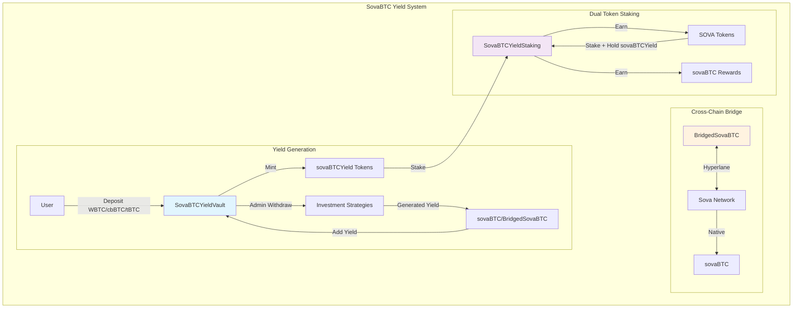
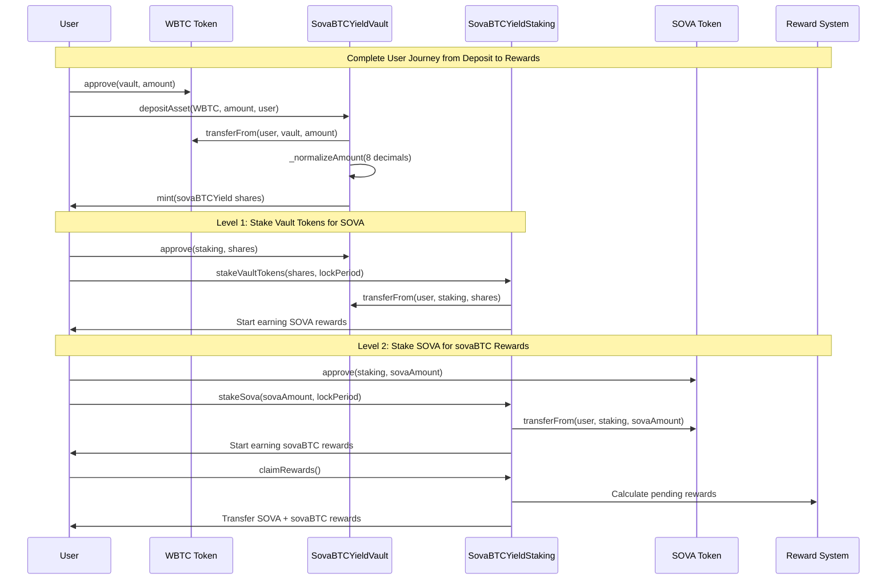
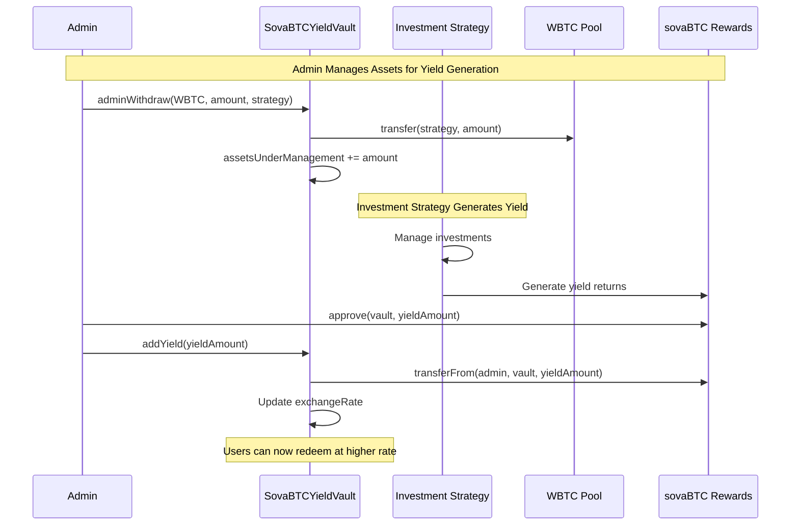
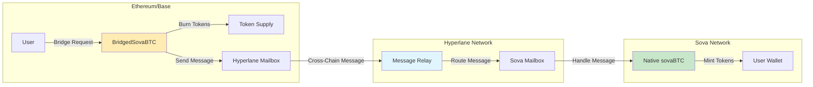
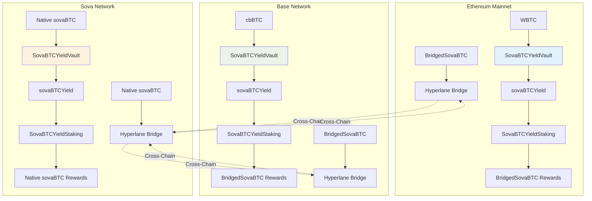
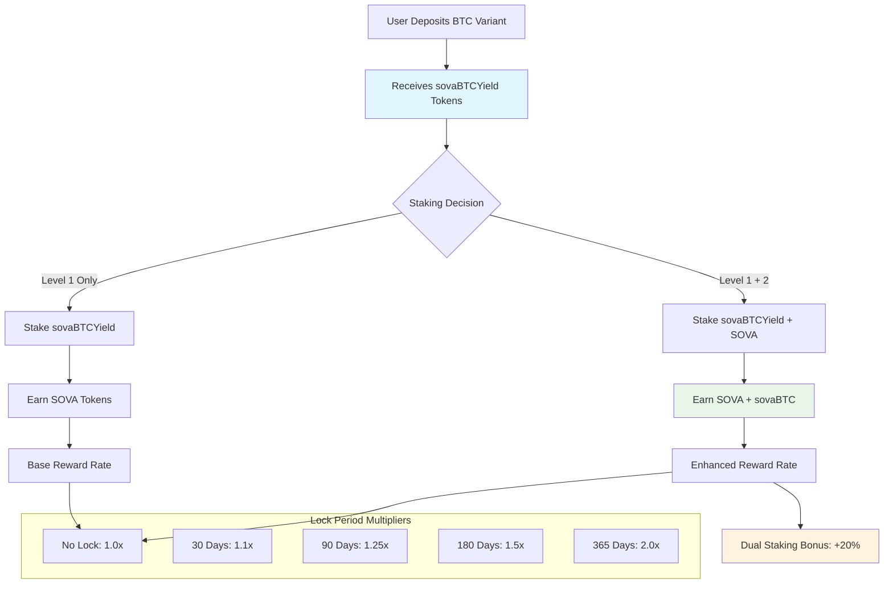

# Sova Contracts

This repository contains both the predeploy contracts for the Sova Network and the **SovaBTC Yield System** - a comprehensive Bitcoin yield generation platform that extends Sova Network's capabilities to EVM networks.

## 🚀 SovaBTC Yield System

The SovaBTC Yield System is a multi-chain yield-generating vault that accepts various Bitcoin variants and provides Bitcoin-denominated yield through actively managed investment strategies. This represents a complete evolution from simple 1:1 wrapping to a sophisticated yield-generating platform.

### 🎯 Key Features

- **🏦 ERC-4626 Compliant Yield Vault**: Accept multiple Bitcoin variants (WBTC, cbBTC, tBTC, native sovaBTC)
- **📈 Admin-Managed Yield Generation**: Professional investment strategies to generate Bitcoin returns
- **🔗 Cross-Chain sovaBTC Distribution**: Native sovaBTC on Sova Network, BridgedSovaBTC elsewhere via Hyperlane
- **🥩 Dual Token Staking System**: Symbiotic staking rewards (sovaBTCYield → SOVA → sovaBTC)
- **🌐 Multi-Network Support**: Ethereum, Base, Sova Network with network-aware deployments
- **🛡️ Enterprise Security**: Role-based access control, pausability, upgradeability

### 🏗️ System Architecture



## 📋 Core Contracts

### 1. SovaBTCYieldVault.sol
**ERC-4626 Compliant Yield Vault**

- **Purpose**: Multi-asset Bitcoin yield generation
- **Assets**: WBTC, cbBTC, tBTC, native sovaBTC
- **Shares**: `sovaBTCYield` tokens (8 decimals)
- **Yield**: Generated through admin-managed investment strategies
- **Features**: Asset management, decimal normalization, exchange rate tracking

```solidity
// Deposit any supported Bitcoin variant
function depositAsset(address asset, uint256 amount, address receiver) 
    external returns (uint256 shares);

// Redeem vault shares for sovaBTC rewards
function redeemForRewards(uint256 shares, address receiver) 
    external returns (uint256 rewardAmount);

// Admin adds yield to increase vault value
function addYield(uint256 rewardAmount) external onlyOwner;
```

### 2. BridgedSovaBTC.sol
**Cross-Chain sovaBTC Token**

- **Purpose**: Canonical sovaBTC representation on non-Sova networks
- **Bridge**: Hyperlane protocol for secure cross-chain messaging
- **Access**: Role-based minting (VAULT_ROLE, BRIDGE_ROLE)
- **Features**: Burn-and-mint bridging, emergency controls

```solidity
// Bridge tokens to Sova Network
function bridgeToSova(address recipient, uint256 amount) external;

// Handle cross-chain messages from Hyperlane
function handle(uint32 origin, bytes32 sender, bytes calldata body) external;

// Mint tokens (authorized roles only)
function mint(address to, uint256 amount) external;
```

### 3. SovaBTCYieldStaking.sol
**Dual Token Staking System**

- **Level 1**: Stake `sovaBTCYield` → Earn `SOVA` tokens
- **Level 2**: Stake `SOVA` + hold `sovaBTCYield` → Earn `sovaBTC`/`BridgedSovaBTC`
- **Features**: Lock periods, compound rewards, emergency unstaking

```solidity
// Stake vault tokens to earn SOVA
function stakeVaultTokens(uint256 amount, uint256 lockPeriod) external;

// Stake SOVA to earn sovaBTC (requires vault tokens staked)
function stakeSova(uint256 amount, uint256 lockPeriod) external;

// Claim accumulated rewards
function claimRewards() external;
```

## 🌐 Network Deployment

### Supported Networks

| Network | Primary Asset | Reward Token | Deployment Status |
|---------|--------------|--------------|-------------------|
| **Ethereum** | WBTC | BridgedSovaBTC | ✅ Ready |
| **Base** | cbBTC | BridgedSovaBTC | ✅ Ready |
| **Sova Network** | Native sovaBTC | Native sovaBTC | ✅ Ready |
| **Sepolia** | Test WBTC | BridgedSovaBTC | ✅ Ready |

### Asset Support by Network

**Ethereum Mainnet:**
- WBTC (0x2260FAC5E5542a773Aa44fBCfeDf7C193bc2C599)
- cbBTC, tBTC

**Base:**
- cbBTC (0xcbB7C0000aB88B473b1f5aFd9ef808440eed33Bf)
- tBTC

**Sova Network:**
- Native sovaBTC (0x2100000000000000000000000000000000000020)

## 🛠️ Development Setup

### Prerequisites

- [Foundry](https://getfoundry.sh/) (latest version)
- Node.js 16+ and npm
- Git

### Installation

```bash
git clone https://github.com/SovaNetwork/sova-contracts.git
cd sova-contracts
make setup
```

### Environment Configuration

1. Copy environment template:
```bash
cp .env.example .env
```

2. Configure your `.env` file:
```bash
# Deployment Configuration
PRIVATE_KEY=your_private_key_here
OWNER_ADDRESS=0x...

# Network RPC URLs
ETHEREUM_RPC_URL=https://mainnet.infura.io/v3/your-key
BASE_RPC_URL=https://mainnet.base.org
SOVA_RPC_URL=https://rpc.sova.network

# Token Addresses
SOVA_TOKEN_ADDRESS=0x...

# Hyperlane Mailbox Addresses
HYPERLANE_MAILBOX_MAINNET=0x...
HYPERLANE_MAILBOX_BASE=0x...
```

## 🧪 Testing

### Comprehensive Test Suite

The project includes **92 tests** with excellent coverage:

- **SovaBTCYieldVault**: 95%+ coverage
- **SovaBTCYieldStaking**: 84%+ coverage  
- **BridgedSovaBTC**: 86%+ coverage

### Running Tests

```bash
# Run all tests
make test

# Run specific test suites
forge test --match-contract SovaBTCYieldSystemTest
forge test --match-contract DualTokenStakingTest
forge test --match-contract SovaBTCWrapperTest

# Generate detailed coverage report
make coverage

# Run tests with gas reporting
make gas-report
```

### Test Categories

**Vault Tests:**
- Multi-asset deposits and withdrawals
- Exchange rate calculations
- Admin yield management
- Decimal normalization (6, 8, 18 decimals)
- Error handling and edge cases

**Staking Tests:**
- Dual token staking mechanics
- Lock periods and multipliers
- Reward calculations and claiming
- Emergency unstaking scenarios

**Bridge Tests:**
- Cross-chain message handling
- Role-based access control
- Hyperlane integration
- Burn-and-mint operations

## 🚀 Deployment

### Network-Aware Deployment

The deployment script automatically configures contracts based on the target network:

```bash
# Deploy to Ethereum Mainnet
forge script script/DeploySovaBTCYieldSystem.s.sol --rpc-url $ETHEREUM_RPC_URL --broadcast --verify

# Deploy to Base
forge script script/DeploySovaBTCYieldSystem.s.sol --rpc-url $BASE_RPC_URL --broadcast --verify

# Deploy to Sova Network  
forge script script/DeploySovaBTCYieldSystem.s.sol --rpc-url $SOVA_RPC_URL --broadcast --verify
```

### Deployment Artifacts

Deployment information is automatically saved to `deployments/yield-system-{chainId}.json`:

```json
{
  "chainId": 1,
  "isSovaNetwork": false,
  "blockNumber": 12345678,
  "contracts": {
    "bridgedSovaBTC": "0x...",
    "yieldVault": "0x...",
    "yieldStaking": "0x..."
  }
}
```

## 🔄 System Flow Diagrams

### User Journey: Deposit to Staking Flow



### Admin Yield Management Flow



### Cross-Chain Bridging Flow



### Multi-Network Deployment Architecture



### Dual Token Staking Reward Mechanics



## 📊 Usage Examples

### For Users

**Deposit Bitcoin Variants:**
```solidity
// Approve WBTC
IERC20(wbtc).approve(vaultAddress, amount);

// Deposit WBTC and receive sovaBTCYield shares
uint256 shares = vault.depositAsset(wbtc, amount, msg.sender);
```

**Stake for Rewards:**
```solidity
// 1. Stake vault tokens to earn SOVA
vault.approve(stakingAddress, shares);
staking.stakeVaultTokens(shares, lockPeriod);

// 2. Stake SOVA to earn sovaBTC (requires vault tokens staked)
sova.approve(stakingAddress, sovaAmount);
staking.stakeSova(sovaAmount, lockPeriod);

// 3. Claim rewards
staking.claimRewards();
```

### For Admins

**Manage Yield Generation:**
```solidity
// Withdraw assets for investment strategies
vault.adminWithdraw(asset, amount, destination);

// Add generated yield back to vault
sovaBTC.approve(vaultAddress, yieldAmount);
vault.addYield(yieldAmount);
```

**Configure Staking:**
```solidity
// Set reward rates (SOVA per second, sovaBTC per second, dual bonus)
staking.setRewardRates(1e15, 1e13, 12000); // 20% dual staking bonus

// Add reward tokens
staking.addRewards(sovaAmount, sovaBTCAmount);
```

## 🔒 Security Features

### Access Control
- **Owner-only functions**: Asset management, yield distribution, emergency controls
- **Role-based permissions**: VAULT_ROLE, BRIDGE_ROLE for BridgedSovaBTC
- **Multi-signature recommended**: For production deployments

### Emergency Features
- **Pausability**: All contracts can be paused in emergencies
- **Emergency unstaking**: Users can exit stakes with penalty if needed
- **Upgrade controls**: UUPS proxy pattern with admin controls

### Audit Considerations
- **Reentrancy protection**: All external calls protected
- **Integer overflow protection**: Solidity 0.8+ built-in protections
- **Input validation**: Comprehensive zero-address and zero-amount checks

## 🏛️ Sova Network Predeployments

The Sova Network enables smart contracts to directly interact with Bitcoin through precompiles:

### Predeploy Contracts
- **SovaL1Block** (`0x2100000000000000000000000000000000000015`) - Bitcoin state tracking
- **SovaBTC** (`0x2100000000000000000000000000000000000020`) - Bitcoin-backed ERC20 token
- **SovaBitcoin** - Library for Bitcoin precompile interactions

### Verification

```bash
# Verify deployed bytecode matches local compilation
forge inspect src/SovaBTC.sol:SovaBTC deployedBytecode
forge inspect src/SovaL1Block.sol:SovaL1Block deployedBytecode
```

## 📚 Additional Resources

### Documentation
- [Product Specification](./PRODUCT_SPEC.md) - Detailed technical specification
- [Deployment Guide](./docs/deployment.md) - Step-by-step deployment instructions
- [Integration Guide](./docs/integration.md) - How to integrate with your dApp

### Development Tools

```bash
# Format code
make format

# Generate gas reports
make gas-report

# Run static analysis
make analyze

# Clean build artifacts
make clean
```

### Makefile Commands

```bash
make help          # Show all available commands
make setup         # Install dependencies
make build         # Compile contracts
make test          # Run test suite
make coverage      # Generate coverage report
make deploy        # Deploy contracts
make format        # Format Solidity code
make gas-report    # Detailed gas usage analysis
```

## 🤝 Contributing

1. Fork the repository
2. Create a feature branch (`git checkout -b feature/amazing-feature`)
3. Run tests (`make test`)
4. Ensure code formatting (`make format`)
5. Commit changes (`git commit -m 'Add amazing feature'`)
6. Push to branch (`git push origin feature/amazing-feature`)
7. Open a Pull Request

## 📄 License

This project is licensed under the MIT License - see the [LICENSE](LICENSE) file for details.

## 🔗 Links

- [Sova Network](https://sova.network)
- [Documentation](https://docs.sova.network)
- [Discord Community](https://discord.gg/sova)
- [Twitter](https://twitter.com/SovaNetwork)

---

**Built with ❤️ by the Sova Network team**