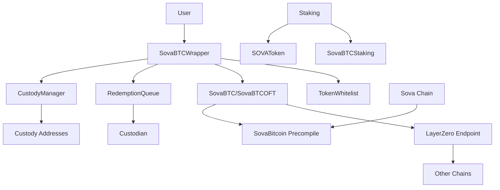

# SovaBTC - Multi-Chain Bitcoin-Backed Token Protocol

[](https://github.com/SovaNetwork/contracts)
[](https://github.com/SovaNetwork/contracts)
[](LICENSE)

SovaBTC is a comprehensive, multi-chain Bitcoin-backed token protocol that enables seamless Bitcoin interactions across different blockchain networks. Built with LayerZero's Omnichain Fungible Token (OFT) standard, it provides secure custody management, queued redemptions, and yield-generating staking capabilities.

## 🌟 Key Features

### 🔗 Multi-Chain Compatibility
- **LayerZero OFT Integration**: Seamless cross-chain Bitcoin transfers
- **Unified Supply Management**: Consistent total supply across all chains
- **Cross-Chain Messaging**: Secure burn/mint operations via LayerZero

### 🏦 Advanced Custody & Security
- **Multi-Signature Custody**: Configurable custody addresses for enhanced security
- **Role-Based Access Control**: Granular permissions for different operations
- **Emergency Controls**: Pause functionality and emergency token recovery
- **Queued Redemptions**: Configurable time delays for large redemptions

### 💰 Multi-Token Support
- **Token Whitelist Management**: Support for various BTC-pegged tokens (WBTC, USDC, etc.)
- **Automatic Decimal Conversion**: Seamless handling of tokens with different decimal places
- **Reserve Validation**: Real-time reserve checking for redemptions

### 🚀 Yield Generation
- **SovaBTC Staking**: Earn SOVA tokens by staking SovaBTC
- **SOVA Revenue Sharing**: Stake SOVA tokens to earn protocol revenue
- **Flexible Lock Periods**: Enhanced rewards for longer staking commitments

### ⚡ Direct Bitcoin Integration (Sova Chain)
- **Native Bitcoin Transactions**: Direct Bitcoin withdrawal via precompile
- **Immediate Settlement**: No queue delays for Bitcoin redemptions on Sova chain
- **Bitcoin Address Conversion**: Automatic address format handling

## 🏗️ Architecture Overview



## 📋 Contract Overview

### Core Contracts

| Contract | Description | Key Features |
|----------|-------------|--------------|
| `SovaBTC.sol` | Main Bitcoin-backed token contract | ERC20, minting, burning, Bitcoin integration |
| `SovaBTCOFT.sol` | LayerZero OFT implementation | Cross-chain transfers, omnichain compatibility |
| `SovaBTCWrapper.sol` | Multi-token wrapper and main interface | Deposits, redemptions, custody integration |
| `TokenWhitelist.sol` | Approved token management | Add/remove tokens, decimal handling |
| `RedemptionQueue.sol` | Queued redemption system | Time delays, reserve validation, batch processing |
| `CustodyManager.sol` | Security and custody controls | Role management, destination validation |

### Staking System

| Contract | Description | Key Features |
|----------|-------------|--------------|
| `SovaBTCStaking.sol` | SovaBTC staking contract | Stake SovaBTC, earn SOVA rewards |
| `SOVAToken.sol` | Protocol governance token | Minting controls, revenue sharing |

### Utility Contracts

| Contract | Description | Key Features |
|----------|-------------|--------------|
| `SovaBitcoin.sol` | Bitcoin precompile library | Address conversion, transaction handling |
| `SovaL1Block.sol` | Bitcoin block data interface | L1 block information for Sova chain |

## 🧪 Testing & Coverage

Our comprehensive test suite ensures robust functionality across all components:

- **📊 Test Coverage**: 99.84% lines (1286/1288), 99.68% statements (1259/1263), 99.66% branches (289/290), 100% functions (296/296)
- **✅ Test Results**: 838/838 tests passing (100% success rate)
- **🏆 Achievement**: Near-perfect coverage across 41 test suites with enterprise-grade validation
  - **🔍 Test Categories**:
    - Unit tests for all contracts (100% function coverage)
    - Integration tests for cross-contract interactions
    - Edge case and boundary testing
    - Security and access control testing
    - Cross-chain functionality testing
    - Malicious token interaction testing
    - Comprehensive coverage testing (targeting specific missing branches)
    - Fuzz testing for mathematical operations
    - Precompile failure simulation testing

### Running Tests

```bash
# Run all tests
forge test

# Run tests with coverage
forge coverage

# Run specific test file
forge test --match-path test/RedemptionQueue_Coverage.t.sol

# Run tests with gas reporting
forge test --gas-report
```

## 🚀 Quick Start

### Prerequisites

- [Foundry](https://book.getfoundry.sh/getting-started/installation)
- Node.js 16+
- Git

### Installation

```bash
# Clone the repository
git clone https://github.com/your-repo/contracts.git
cd contracts

# Install dependencies
forge install

# Build contracts
forge build

# Run tests
forge test
```

### Basic Usage

#### 1. Deploy Core Contracts

```bash
# Deploy to local network
forge script script/DeployTokenWrapper.s.sol --rpc-url http://localhost:8545 --broadcast
```

#### 2. Deposit BTC-Pegged Tokens

```solidity
// Approve tokens
IERC20(wbtcAddress).approve(wrapperAddress, amount);

// Deposit WBTC to get SovaBTC
ISovaBTCWrapper(wrapperAddress).deposit(wbtcAddress, amount);
```

#### 3. Cross-Chain Transfer

```solidity
// Send SovaBTC to another chain
bytes memory options = OptionsBuilder.newOptions().addExecutorLzReceiveOption(200000, 0);
SendParam memory sendParam = SendParam({
    dstEid: destinationEndpointId,
    to: addressToBytes32(recipient),
    amountLD: amount,
    minAmountLD: amount,
    extraOptions: options,
    composeMsg: "",
    oftCmd: ""
});

oft.send{value: nativeFee}(sendParam, MessagingFee(nativeFee, 0), payable(msg.sender));
```

#### 4. Queue Redemption (Manual Fulfillment Process)

```solidity
// 1. User queues redemption (burns SovaBTC immediately, creates redemption request)
uint256 redemptionId = IRedemptionQueue(queueAddress).redeem(wbtcAddress, sovaAmount);

// 2. Wait for 10-day delay period to complete
// Users can track their redemption status:
bool isReady = IRedemptionQueue(queueAddress).isRedemptionReady(redemptionId);

// 3. After delay period, authorized custodian manually fulfills redemption
// (Custodian must call this - tokens are NOT automatically sent!)
IRedemptionQueue(queueAddress).fulfillRedemption(redemptionId);

// 4. Multiple redemptions can be processed in batches by custodians
uint256[] memory redemptionIds = [1, 2, 3];
IRedemptionQueue(queueAddress).batchFulfillRedemptions(redemptionIds);
```

**⚠️ Important**: Redemptions require **manual fulfillment by authorized custodians** after the delay period. Users do not automatically receive tokens - they must wait for custodians to process their redemption requests.

#### 4a. Custodian Management (Admin Only)

**Adding Custodians**:
```bash
# Run the custodian authorization script
forge script script/SetCustodian.s.sol --fork-url https://sepolia.base.org --broadcast

# Or manually call the contract function (owner only)
cast send $REDEMPTION_QUEUE "setCustodian(address,bool)" $CUSTODIAN_ADDRESS true --rpc-url https://sepolia.base.org --private-key $PRIVATE_KEY
```

**Web UI Admin Panel**:
```bash
# Start the frontend
cd ui && npm run dev

# Navigate to admin panel
open http://localhost:3000/admin

# Connect wallet with authorized custodian address
# Access full redemption management dashboard
```

#### 5. Stake for Rewards

```solidity
// Stake SovaBTC to earn SOVA
ISovaBTCStaking(stakingAddress).stake(poolId, amount, lockPeriod);

// Claim rewards
ISovaBTCStaking(stakingAddress).claimRewards(poolId);
```

## 🔧 Configuration

### Environment Variables

```bash
# Deployment
PRIVATE_KEY=your_private_key_here
RPC_URL=your_rpc_url_here

# LayerZero Configuration
LZ_ENDPOINT_ETHEREUM=0x1a44076050125825900e736c501f859c50fE728c
LZ_ENDPOINT_ARBITRUM=0x1a44076050125825900e736c501f859c50fE728c
LZ_ENDPOINT_SOVA=your_sova_endpoint_here
```

### Contract Parameters

#### TokenWhitelist
- **Supported Tokens**: WBTC (8 decimals), USDC (6 decimals), custom tokens
- **Admin Controls**: Add/remove tokens, update decimals

#### RedemptionQueue
- **Default Delay**: 10 days
- **Min Delay**: 1 hour
- **Max Delay**: 30 days
- **Custodian Roles**: Multi-signature custody support

#### Staking
- **SovaBTC Pool**: Stake SovaBTC, earn SOVA rewards
- **SOVA Pool**: Stake SOVA, earn protocol revenue
- **Lock Periods**: 0-365 days with multiplier rewards

## 🔒 Security Features

### Access Control
- **Owner**: Contract upgrades, parameter changes
- **Custodian Role**: Redemption fulfillment
- **Emergency Role**: Pause contracts, emergency withdrawals
- **Custody Admin**: Manage custody addresses

### Safety Mechanisms
- **Reentrancy Protection**: All external functions protected
- **Pause Functionality**: Emergency stop capability
- **Reserve Validation**: Prevent over-redemption
- **Time Delays**: Configurable delays for large operations

### Audit Considerations
- **Exceptional Test Coverage**: 99.84% lines, 99.68% statements, 99.66% branches, 100% functions
- **838 Comprehensive Tests**: Enterprise-grade validation across all contract functionality
- **Security-First Testing**: Malicious token interactions, reentrancy protection, access controls
- **Edge Case Coverage**: Boundary values, arithmetic operations, failure scenarios
- **Multiple security patterns implemented**
- **External dependency isolation**
- **Upgrade safety with UUPS proxy pattern**

## 🌐 Supported Networks

| Network | Status | LayerZero Endpoint | SovaBTC Address |
|---------|--------|--------------------|-----------------|
| Ethereum | ✅ Supported | `0x1a44076050125825900e736c501f859c50fE728c` | TBD |
| Arbitrum | ✅ Supported | `0x1a44076050125825900e736c501f859c50fE728c` | TBD |
| Sova Chain | ✅ Supported | Custom Endpoint | TBD |
| Polygon | 🔄 Planned | TBD | TBD |
| BSC | 🔄 Planned | TBD | TBD |

## 👥 Custodian Management

### Current Authorized Custodians

| Address | Role | Status |
|---------|------|--------|
| `0x75BbFf2206b6Ad50786Ee3ce8A81eDb72f3e381b` | Deployer/Admin | ✅ Active |

### Adding New Custodians

**Prerequisites**:
- You must be the contract owner
- Have the target wallet address ready
- Ensure the address is trustworthy (custodians can fulfill redemptions)

**Method 1: Using the Script** (Recommended)
```bash
# 1. Edit the script to add your custodian address
# Edit script/SetCustodian.s.sol, update DEPLOYER_ADDRESS constant

# 2. Run the authorization script
forge script script/SetCustodian.s.sol --fork-url https://sepolia.base.org --broadcast
```

**Method 2: Direct Contract Call**
```bash
# Set environment variables
export REDEMPTION_QUEUE="0x6CDD3cD1c677abbc347A0bDe0eAf350311403638"
export CUSTODIAN_ADDRESS="0xYourCustodianAddressHere"

# Authorize custodian (owner only)
cast send $REDEMPTION_QUEUE "setCustodian(address,bool)" $CUSTODIAN_ADDRESS true \
  --rpc-url https://sepolia.base.org \
  --private-key $PRIVATE_KEY

# Verify authorization
cast call $REDEMPTION_QUEUE "custodians(address)" $CUSTODIAN_ADDRESS \
  --rpc-url https://sepolia.base.org
```

**Method 3: Via Web UI** (Future Enhancement)
```bash
# Coming soon: Admin interface for custodian management
# Navigate to http://localhost:3000/admin
# Use "Role Management" section to add/remove custodians
```

### Removing Custodians

```bash
# Remove custodian access (owner only)
cast send $REDEMPTION_QUEUE "setCustodian(address,bool)" $CUSTODIAN_ADDRESS false \
  --rpc-url https://sepolia.base.org \
  --private-key $PRIVATE_KEY
```

### Custodian Responsibilities

**Daily Operations**:
- Monitor pending redemptions at `/admin` dashboard
- Fulfill ready redemptions (after 10-day delay)
- Process batch fulfillments efficiently
- Verify reserve availability before fulfillment

**Security Practices**:
- Keep custodian wallet secure (hardware wallet recommended)
- Verify redemption details before fulfillment
- Monitor for suspicious redemption patterns
- Report any anomalies to protocol administrators

**Emergency Procedures**:
- Contact protocol owner if issues arise
- Emergency pause procedures (owner only)
- Coordinate with other custodians for coverage

### Web UI Admin Dashboard

**Access Requirements**:
1. Connected wallet must be authorized custodian
2. Navigate to `http://localhost:3000/admin`
3. Dashboard will show access denied if not authorized

**Features Available**:
- View all pending redemptions across users
- Batch select multiple redemptions
- Individual and batch fulfillment actions
- Real-time status updates and transaction tracking
- Reserve monitoring for each token type

**Dashboard Sections**:
- **Overview Stats**: Pending, ready, users, selected counts
- **Batch Actions**: Select all, batch fulfill operations
- **Redemption List**: Individual redemption cards with status
- **Transaction Status**: Real-time feedback and explorer links

## 📚 API Reference

### SovaBTCWrapper

```solidity
function deposit(address token, uint256 amount) external;
function previewDeposit(address token, uint256 amount) external view returns (uint256);
function emergencyWithdraw(address token, uint256 amount, address to) external;
function setRedemptionQueue(address _redemptionQueue) external;
```

### RedemptionQueue

```solidity
// User Functions - Create redemption requests
function redeem(address token, uint256 sovaAmount) external returns (uint256 redemptionId);
function getUserRedemptions(address user) external view returns (uint256[] memory);
function getPendingRedemptions(address user) external view returns (RedemptionRequest[] memory);
function isRedemptionReady(uint256 redemptionId) external view returns (bool);
function getRedemptionReadyTime(uint256 redemptionId) external view returns (uint256);

// Custodian Functions - Manual fulfillment (requires authorization)
function fulfillRedemption(uint256 redemptionId) external; // onlyCustodian
function batchFulfillRedemptions(uint256[] calldata redemptionIds) external; // onlyCustodian

// View Functions
function getRedemptionRequest(uint256 redemptionId) external view returns (RedemptionRequest memory);
function getAvailableReserve(address token) external view returns (uint256);
```

**Key Points:**
- 🔥 `redeem()` **burns sovaBTC immediately** and creates a redemption request with unique ID
- ⏰ **10-day delay** before redemption can be fulfilled
- 👥 **Manual fulfillment**: Authorized custodians must call `fulfillRedemption()` 
- 📊 **Multiple redemptions**: Users can have unlimited concurrent redemption requests
- 🔍 **Tracking**: Each redemption has a unique ID for status tracking

### SovaBTCStaking

```solidity
function stake(uint256 poolId, uint256 amount, uint256 lockPeriod) external;
function unstake(uint256 poolId, uint256 amount) external;
function claimRewards(uint256 poolId) external;
function pendingRewards(uint256 poolId, address user) external view returns (uint256);
```

## 🤝 Contributing

We welcome contributions! Please see our [Contributing Guidelines](CONTRIBUTING.md) for details.

### Development Setup

```bash
# Fork and clone the repository
git clone https://github.com/your-username/contracts.git

# Install dependencies
forge install

# Create a feature branch
git checkout -b feature/your-feature-name

# Make changes and test
forge test

# Submit a pull request
```

### Code Standards
- Solidity ^0.8.20
- Comprehensive tests required
- NatSpec documentation
- Gas optimization considered
- Security-first approach

## 📄 License

This project is licensed under the MIT License - see the [LICENSE](LICENSE) file for details.

## 🔗 Links

- **Documentation**: [docs.sovabtc.com](https://docs.sovabtc.com)
- **Website**: [sovabtc.com](https://sovabtc.com)
- **Discord**: [Join our community](https://discord.gg/sovabtc)
- **Twitter**: [@SovaBTC](https://twitter.com/sovabtc)

## ⚠️ Disclaimer

This software is provided "as is" without warranty. Use at your own risk. Always conduct thorough testing and security audits before deploying to mainnet.

---

## 🔧 Quick Command Reference

### Custodian Management
```bash
# Authorize your deployer address (run once)
forge script script/SetCustodian.s.sol --fork-url https://sepolia.base.org --broadcast

# Check if address is authorized
cast call 0x6CDD3cD1c677abbc347A0bDe0eAf350311403638 "custodians(address)" YOUR_ADDRESS --rpc-url https://sepolia.base.org

# Access admin dashboard
cd ui && npm run dev
open http://localhost:3000/admin
```

### Development Commands
```bash
# Test protocol functionality
forge script script/TestFullProtocolFlow.s.sol --fork-url https://sepolia.base.org --broadcast

# Run frontend
cd ui && npm run dev

# Deploy contracts (if needed)
forge script script/Deploy.s.sol --fork-url https://sepolia.base.org --broadcast
```

### Contract Addresses (Base Sepolia)
```bash
export REDEMPTION_QUEUE="0x6CDD3cD1c677abbc347A0bDe0eAf350311403638"
export WRAPPER="0x58c969172fa3A1D8379Eb942Bae4693d3b9cd58c"
export SOVABTC="0xF6c09Dc46AA90Ee3BcBE7AD955c5453d7247295F"
```

---

Built with ❤️ by the SovaBTC team
