# Sova Contracts

This repository contains both the predeploy contracts for the Sova Network and the **SovaBTC Yield System** - a comprehensive Bitcoin yield generation platform that extends Sova Network's capabilities to EVM networks.

## 🚀 SovaBTC Yield System

The SovaBTC Yield System is a multi-chain yield-generating vault that accepts various Bitcoin variants and provides Bitcoin-denominated yield through actively managed investment strategies. This represents a complete evolution from simple 1:1 wrapping to a sophisticated yield-generating platform.

### 🎯 Key Features

- **🏦 ERC-4626 Compliant Yield Vault**: Accept multiple Bitcoin variants (WBTC, cbBTC, tBTC, native sovaBTC)
- **📈 Admin-Managed Yield Generation**: Professional investment strategies to generate Bitcoin returns
- **🔗 Cross-Chain sovaBTC Distribution**: Native sovaBTC on Sova Network, BridgedSovaBTC elsewhere via Hyperlane
- **🥩 Dual Token Staking System**: Symbiotic staking rewards (sovaBTCYield → SOVA → sovaBTC)
- **🌐 Multi-Network Support**: Ethereum, Base, Sova Network with network-aware deployments
- **🛡️ Enterprise Security**: Role-based access control, pausability, upgradeability

### 🏗️ System Architecture


## 📋 Core Contracts

### 1. SovaBTCYieldVault.sol
**ERC-4626 Compliant Yield Vault**

- **Purpose**: Multi-asset Bitcoin yield generation vault
- **Standard**: ERC-4626 with additional multi-asset support
- **Assets**: WBTC (8 decimals), cbBTC (8 decimals), tBTC (18 decimals), native sovaBTC (8 decimals)
- **Shares**: `sovaBTCYield` tokens (8 decimals, matching Bitcoin precision)
- **Yield Source**: Admin-managed investment strategies with controlled asset withdrawal
- **Exchange Rate**: Dynamic rate tracking yield accumulation (starts at 1:1)

#### 🔑 Critical Functions

```solidity
// === USER FUNCTIONS ===

// Standard ERC-4626 deposit (primary asset only)
function deposit(uint256 assets, address receiver) external returns (uint256 shares);

// Multi-asset deposit with decimal normalization
function depositAsset(address asset, uint256 amount, address receiver) 
    external returns (uint256 shares);

// Standard ERC-4626 redemption (for underlying assets)
function redeem(uint256 shares, address receiver, address owner) 
    external returns (uint256 assets);

// Redeem vault shares for sovaBTC/BridgedSovaBTC rewards (yield distribution)
function redeemForRewards(uint256 shares, address receiver) 
    external returns (uint256 rewardAmount);

// === ADMIN FUNCTIONS ===

// Add supported Bitcoin variant with metadata
function addSupportedAsset(address asset, string memory name) external onlyOwner;

// Remove asset support (existing deposits remain valid)
function removeSupportedAsset(address asset) external onlyOwner;

// Withdraw assets for investment strategies
function adminWithdraw(address asset, uint256 amount, address destination) external onlyOwner;

// Add yield to vault (increases exchange rate)
function addYield(uint256 rewardAmount) external onlyOwner;

// Update assets under management tracking
function updateAssetsUnderManagement(uint256 newAmount) external onlyOwner;

// Emergency pause/unpause
function pause() external onlyOwner;
function unpause() external onlyOwner;
```

#### 🛡️ Admin Controls & Security

- **Asset Management**: Owner can add/remove supported Bitcoin variants
- **Investment Control**: Owner withdraws assets for yield generation strategies
- **Yield Distribution**: Owner adds generated yield, automatically updating exchange rates
- **Emergency Controls**: Pausable for security incidents
- **Upgrade Path**: UUPS upgradeable with owner-controlled upgrades
- **Decimal Normalization**: Automatic handling of 6, 8, and 18 decimal assets

#### 💡 Key Implementation Details

- **First Deposit Handling**: Custom 1:1 share calculation when totalSupply is 0
- **Multi-Asset Support**: Normalizes all deposits to 8 decimals internally
- **Exchange Rate Mechanism**: `exchangeRate = (totalAssets + yield) / totalShares`
- **Assets Under Management**: Tracks assets withdrawn for investment strategies
- **Reward Token Integration**: Network-aware (native sovaBTC on Sova, BridgedSovaBTC elsewhere)

### 2. BridgedSovaBTC.sol
**Cross-Chain sovaBTC Token via Hyperlane**

- **Purpose**: Canonical sovaBTC representation on non-Sova networks (Ethereum, Base, etc.)
- **Bridge Protocol**: Hyperlane for secure cross-chain messaging
- **Token Standard**: ERC-20 with 8 decimals (matching native sovaBTC)
- **Architecture**: Burn-and-mint bridge model
- **Access Control**: Role-based permissions (BRIDGE_ROLE, VAULT_ROLE, ADMIN_ROLE)

#### 🔑 Critical Functions

```solidity
// === USER FUNCTIONS ===

// Bridge tokens from current chain to Sova Network
function bridgeToSova(address recipient, uint256 amount) external;
// Mechanism: Burns tokens locally, sends Hyperlane message to mint on Sova

// === HYPERLANE INTEGRATION ===

// Handle incoming cross-chain messages (called by Hyperlane Mailbox)
function handle(uint32 origin, bytes32 sender, bytes calldata body) external;
// Decodes: (address recipient, uint256 amount)
// Action: Mints tokens to recipient

// === AUTHORIZED FUNCTIONS ===

// Mint tokens (BRIDGE_ROLE or VAULT_ROLE)
function mint(address to, uint256 amount) external;

// Burn tokens from address (BRIDGE_ROLE or VAULT_ROLE)
function burnFrom(address from, uint256 amount) external;

// === ADMIN FUNCTIONS ===

// Update Hyperlane mailbox address
function setHyperlaneMailbox(address newMailbox) external onlyRole(DEFAULT_ADMIN_ROLE);

// Grant vault role to yield vault contract
function grantVaultRole(address vault) external onlyRole(DEFAULT_ADMIN_ROLE);

// Grant bridge role to Hyperlane relayer
function grantBridgeRole(address bridge) external onlyRole(DEFAULT_ADMIN_ROLE);

// Emergency pause/unpause
function pause() external onlyRole(DEFAULT_ADMIN_ROLE);
function unpause() external onlyRole(DEFAULT_ADMIN_ROLE);
```

#### 🔗 Hyperlane Integration Details

**Message Flow (Non-Sova → Sova):**
1. User calls `bridgeToSova(recipient, amount)`
2. Contract burns user's tokens via `_burn(msg.sender, amount)`
3. Encodes message: `abi.encode(recipient, amount)`
4. Dispatches via Hyperlane: `IHyperlaneMailbox(hyperlaneMailbox).dispatch(SOVA_DOMAIN, addressToBytes32(SOVA_NETWORK_SOVABTC), message)`
5. Hyperlane relayers deliver message to Sova Network
6. Native sovaBTC contract mints tokens to recipient

**Message Flow (Sova → Non-Sova):**
1. Native sovaBTC on Sova burns tokens and sends Hyperlane message
2. Hyperlane Mailbox calls `handle(origin, sender, body)` on BridgedSovaBTC
3. Contract verifies `msg.sender == hyperlaneMailbox`
4. Decodes message and mints tokens to recipient

#### 🛡️ Security & Access Control

- **BRIDGE_ROLE**: Granted to Hyperlane relayer for cross-chain minting/burning
- **VAULT_ROLE**: Granted to SovaBTCYieldVault for yield distribution
- **DEFAULT_ADMIN_ROLE**: Contract owner for configuration and emergency controls
- **UPGRADER_ROLE**: UUPS upgrade authorization
- **Mailbox Validation**: Only accepts messages from configured Hyperlane mailbox
- **Domain Security**: Hardcoded Sova Network domain ID and sovaBTC address

### 3. SovaBTCYieldStaking.sol
**Dual Token Staking System**

- **Architecture**: Two-tier symbiotic staking requiring both tokens for maximum rewards
- **Level 1**: Stake `sovaBTCYield` → Earn `SOVA` tokens (base rewards)
- **Level 2**: Stake `SOVA` + maintain `sovaBTCYield` stake → Earn `sovaBTC`/`BridgedSovaBTC` (premium rewards)
- **Requirement**: Must stake vault tokens before staking SOVA (enforced dependency)
- **Lock Periods**: 0, 30, 90, 180, 365 days with reward multipliers
- **Compounding**: Auto-compound SOVA rewards back into SOVA stake

#### 🔑 Critical Functions

```solidity
// === STAKING FUNCTIONS ===

// Stake vault tokens (sovaBTCYield) to earn SOVA
function stakeVaultTokens(uint256 amount, uint256 lockPeriod) external;
// Requirements: amount > 0, valid lock period, contract not paused
// Effect: Transfers vault tokens to contract, starts earning SOVA

// Stake SOVA to earn sovaBTC (requires existing vault token stake)
function stakeSova(uint256 amount, uint256 lockPeriod) external;
// Requirements: Must have vault tokens staked, amount > 0, valid lock period
// Effect: Transfers SOVA to contract, starts earning sovaBTC rewards

// === UNSTAKING FUNCTIONS ===

// Unstake vault tokens (respects lock period)
function unstakeVaultTokens(uint256 amount) external;
// Validation: Lock period expired, sufficient staked amount
// Effect: Claims rewards, returns vault tokens

// Unstake SOVA tokens (respects lock period)  
function unstakeSova(uint256 amount) external;
// Validation: Lock period expired, sufficient staked amount
// Effect: Claims rewards, returns SOVA tokens

// Emergency unstake (immediate but with penalty)
function emergencyUnstake() external;
// Penalty: 10% on vault tokens, 20% on SOVA tokens
// Effect: Immediate return of remaining tokens, forfeits rewards

// === REWARD FUNCTIONS ===

// Claim all accumulated rewards
function claimRewards() external;
// Returns: (sovaRewards, sovaBTCRewards)
// Effect: Transfers pending rewards to user

// Compound SOVA rewards back into SOVA stake
function compoundSovaRewards() external;
// Effect: Claims SOVA rewards and automatically stakes them

// === ADMIN FUNCTIONS ===

// Set reward rates and dual staking bonus
function setRewardRates(uint256 vaultToSovaRate, uint256 sovaToSovaBTCRate, uint256 dualBonus) external onlyOwner;
// Validation: dualBonus <= 50000 (500% max)
// Effect: Updates reward calculation parameters

// Add reward tokens to distribution pool
function addRewards(uint256 sovaAmount, uint256 sovaBTCAmount) external onlyOwner;
// Effect: Transfers tokens from owner to contract for distribution

// Emergency pause/unpause
function pause() external onlyOwner;
function unpause() external onlyOwner;
```

#### 🎯 Staking Mechanics

**Lock Period Multipliers:**
- No Lock (0 days): 1.0x rewards
- 30 Days: 1.1x rewards (+10%)
- 90 Days: 1.25x rewards (+25%)
- 180 Days: 1.5x rewards (+50%)
- 365 Days: 2.0x rewards (+100%)

**Dual Staking Bonus:**
- Single staking (vault tokens only): Base SOVA rewards
- Dual staking (vault + SOVA): Base rewards + 20% bonus + sovaBTC rewards
- Bonus applied to SOVA earning rate when both tokens are staked

**Reward Calculation:**
```solidity
// SOVA rewards from vault tokens
sovaRewards = vaultTokensStaked * vaultToSovaRate * timeStaked * lockMultiplier * dualBonus

// sovaBTC rewards from SOVA (requires vault tokens staked)
sovaBTCRewards = sovaTokensStaked * sovaToSovaBTCRate * timeStaked * lockMultiplier
```

#### 🛡️ Security Features

- **Dependency Enforcement**: Cannot stake SOVA without vault tokens
- **Lock Period Validation**: Only predefined lock periods allowed
- **Emergency Exit**: Immediate unstaking with penalties for liquidity
- **Reward Pool Management**: Admin-controlled reward token deposits
- **Pausable**: Emergency halt of all staking operations

## 🔗 Hyperlane Integration

### Overview

The SovaBTC Yield System leverages **Hyperlane** as its cross-chain messaging protocol to enable seamless sovaBTC token bridging between Sova Network and other EVM chains (Ethereum, Base, etc.). This integration follows Hyperlane's **burn-and-mint bridge** pattern for canonical token representation across chains.

### Architecture Design

```mermaid
graph TB
    subgraph "Ethereum/Base Networks"
        A[BridgedSovaBTC Contract] 
        B[Hyperlane Mailbox]
        C[User Wallet]
        A <--> B
        C --> A
    end
    
    subgraph "Hyperlane Network"
        D[Hyperlane Relayers]
        E[Interchain Security Module]
        F[Message Validation]
        B <--> D
        D --> E
        E --> F
    end
    
    subgraph "Sova Network"
        G[Native sovaBTC Contract]
        H[Sova Hyperlane Mailbox]
        I[User Wallet]
        G <--> H
        H --> I
    end
    
    F -.->|Cross-Chain Message| H
    H -.->|Cross-Chain Message| B
    
    style A fill:#ffecb3
    style G fill:#c8e6c9
    style D fill:#e1f5fe
```



### 🔧 Technical Implementation

#### Contract Integration Points

**BridgedSovaBTC.sol Hyperlane Integration:**

```solidity
contract BridgedSovaBTC {
    // Hyperlane configuration
    address public hyperlaneMailbox;           // Hyperlane Mailbox contract
    uint32 public constant SOVA_DOMAIN = 0;   // Sova Network domain ID
    address public constant SOVA_NETWORK_SOVABTC = 0x2100000000000000000000000000000000000020;
    
    // Bridge to Sova Network
    function bridgeToSova(address recipient, uint256 amount) external {
        // 1. Burn tokens on current chain
        _burn(msg.sender, amount);
        
        // 2. Encode cross-chain message
        bytes memory message = abi.encode(recipient, amount);
        
        // 3. Dispatch via Hyperlane
        IHyperlaneMailbox(hyperlaneMailbox).dispatch(
            SOVA_DOMAIN,                           // Destination domain
            addressToBytes32(SOVA_NETWORK_SOVABTC), // Recipient contract
            message                                 // Message payload
        );
        
        emit BridgeTransfer(msg.sender, recipient, amount, SOVA_DOMAIN);
    }
    
    // Handle incoming messages from Hyperlane
    function handle(uint32 origin, bytes32 sender, bytes calldata body) external {
        // Validate caller is Hyperlane Mailbox
        require(msg.sender == hyperlaneMailbox, "Invalid mailbox");
        
        // Decode message
        (address recipient, uint256 amount) = abi.decode(body, (address, uint256));
        
        // Mint tokens to recipient
        _mint(recipient, amount);
        
        emit BridgeReceive(recipient, amount, origin);
    }
}
```

#### Message Flow Specification

**Outbound Flow (Non-Sova → Sova):**

1. **User Initiation**: `bridgeToSova(recipient, amount)`
2. **Token Burn**: `_burn(msg.sender, amount)` - removes tokens from circulation
3. **Message Encoding**: `abi.encode(recipient, amount)` - packs recipient and amount
4. **Hyperlane Dispatch**: 
   ```solidity
   IHyperlaneMailbox(hyperlaneMailbox).dispatch(
       SOVA_DOMAIN,                    // uint32: Destination chain
       addressToBytes32(SOVA_NETWORK_SOVABTC), // bytes32: Target contract
       abi.encode(recipient, amount)   // bytes: Message payload
   );
   ```
5. **Cross-Chain Relay**: Hyperlane validators and relayers process message
6. **Destination Execution**: Native sovaBTC contract on Sova mints tokens

**Inbound Flow (Sova → Non-Sova):**

1. **Hyperlane Delivery**: Mailbox calls `handle(origin, sender, body)`
2. **Caller Validation**: `require(msg.sender == hyperlaneMailbox)`
3. **Message Decoding**: `(address recipient, uint256 amount) = abi.decode(body, (address, uint256))`
4. **Token Mint**: `_mint(recipient, amount)` - creates tokens on destination chain
5. **Event Emission**: `BridgeReceive(recipient, amount, origin)`

### 🛡️ Security Model

#### Access Control Integration

```solidity
// Role-based permissions for Hyperlane integration
bytes32 public constant BRIDGE_ROLE = keccak256("BRIDGE_ROLE");

// Grant to Hyperlane relayer for authorized minting
function grantBridgeRole(address bridge) external onlyRole(DEFAULT_ADMIN_ROLE) {
    _grantRole(BRIDGE_ROLE, bridge);
}

// Validate message origin and sender
function handle(uint32 origin, bytes32 sender, bytes calldata body) external {
    require(msg.sender == hyperlaneMailbox, "Invalid mailbox");
    // Additional origin/sender validation can be added here
}
```

#### Security Guarantees

1. **Mailbox Validation**: Only configured Hyperlane Mailbox can call `handle()`
2. **Message Authentication**: Hyperlane's cryptographic validation ensures message integrity
3. **Domain Isolation**: Hardcoded domain IDs prevent cross-chain confusion
4. **Role-Based Access**: BRIDGE_ROLE restricts minting to authorized relayers
5. **Burn-and-Mint**: Total supply consistency across all chains

### 📊 Hyperlane Configuration

#### Network-Specific Settings

| Network | Mailbox Address | Domain ID | Gas Limit | Security Module |
|---------|----------------|-----------|-----------|-----------------|
| **Ethereum** | `0x...` (TBD) | `1` | `200,000` | MultisigISM |
| **Base** | `0x...` (TBD) | `8453` | `200,000` | MultisigISM |
| **Sova Network** | `0x...` (TBD) | `0` (TBD) | `200,000` | ValidatorAnnounce |

#### Deployment Requirements

**For Hyperlane Team Review:**

1. **Domain Registration**: Sova Network needs official Hyperlane domain ID
2. **Mailbox Deployment**: Hyperlane Mailbox contract on Sova Network
3. **Validator Set**: Configure validators for Sova Network security
4. **Gas Oracle**: Set gas prices for cross-chain transaction estimation
5. **Relayer Network**: Ensure relayer coverage for Sova Network

### 🔍 Message Validation

#### Interchain Security Module (ISM)

The system can integrate with Hyperlane's ISM for enhanced security:

```solidity
// Optional: Custom ISM integration
interface IInterchainSecurityModule {
    function verify(bytes calldata metadata, bytes calldata message) 
        external returns (bool);
}
```

#### Recommended Security Configuration

- **MultisigISM**: For Ethereum/Base with 2/3 validator threshold
- **ValidatorAnnounce**: For Sova Network with announced validator set
- **Custom ISM**: Optional additional validation for high-value transfers

### 🚀 Integration Testing

#### Test Scenarios for Hyperlane Team

```solidity
// Test 1: Successful bridge from Ethereum to Sova
function testBridgeEthereumToSova() {
    // Setup: Deploy BridgedSovaBTC on Ethereum with Hyperlane Mailbox
    // Action: User bridges 1 BTC worth of tokens
    // Expect: Tokens burned on Ethereum, message dispatched
    // Verify: Tokens minted on Sova Network
}

// Test 2: Failed bridge due to insufficient balance
function testBridgeInsufficientBalance() {
    // Action: User attempts to bridge more than balance
    // Expect: Transaction reverts before Hyperlane dispatch
}

// Test 3: Handle invalid message
function testHandleInvalidMessage() {
    // Action: Non-mailbox calls handle()
    // Expect: Transaction reverts with "Invalid mailbox"
}
```

### 📋 Hyperlane Team Checklist

**Pre-Deployment Verification:**

- [ ] **Domain ID Assignment**: Confirm Sova Network domain ID
- [ ] **Mailbox Deployment**: Deploy Hyperlane Mailbox on Sova Network  
- [ ] **Validator Configuration**: Set up validator set for Sova Network
- [ ] **Security Module**: Configure appropriate ISM for security requirements
- [ ] **Gas Oracle**: Set gas price oracle for transaction cost estimation
- [ ] **Relayer Coverage**: Ensure relayer network includes Sova Network
- [ ] **Message Format**: Validate `abi.encode(address, uint256)` compatibility
- [ ] **Address Encoding**: Confirm `addressToBytes32()` conversion compatibility
- [ ] **Event Monitoring**: Set up monitoring for bridge events

**Integration Validation:**

- [ ] **Message Dispatch**: Verify `dispatch()` function integration
- [ ] **Message Handling**: Confirm `handle()` function implementation
- [ ] **Access Controls**: Review role-based permissions model
- [ ] **Error Handling**: Validate failure modes and recovery
- [ ] **Gas Limits**: Confirm 200,000 gas limit sufficiency
- [ ] **Decimal Handling**: Verify 8-decimal token precision compatibility

**Security Review:**

- [ ] **Burn-and-Mint**: Confirm total supply consistency model
- [ ] **Reentrancy Protection**: Review external call safety
- [ ] **Upgrade Safety**: Validate UUPS proxy upgrade mechanisms
- [ ] **Emergency Controls**: Review pause/unpause functionality
- [ ] **Role Management**: Audit role assignment and revocation

## 🌐 Network Deployment

### Supported Networks

| Network | Primary Asset | Reward Token | Deployment Status |
|---------|--------------|--------------|-------------------|
| **Ethereum** | WBTC | BridgedSovaBTC | ✅ Ready |
| **Base** | cbBTC | BridgedSovaBTC | ✅ Ready |
| **Sova Network** | Native sovaBTC | Native sovaBTC | ✅ Ready |
| **Sepolia** | Test WBTC | BridgedSovaBTC | ✅ Ready |

### Asset Support by Network

**Ethereum Mainnet:**
- WBTC (0x2260FAC5E5542a773Aa44fBCfeDf7C193bc2C599)
- cbBTC, tBTC

**Base:**
- cbBTC (0xcbB7C0000aB88B473b1f5aFd9ef808440eed33Bf)
- tBTC

**Sova Network:**
- Native sovaBTC (0x2100000000000000000000000000000000000020)

## 🛠️ Development Setup

### Prerequisites

- [Foundry](https://getfoundry.sh/) (latest version)
- Node.js 16+ and npm
- Git

### Installation

```bash
git clone https://github.com/SovaNetwork/sova-contracts.git
cd sova-contracts
make setup
```

### Environment Configuration

1. Copy environment template:
```bash
cp .env.example .env
```

2. Configure your `.env` file:
```bash
# Deployment Configuration
PRIVATE_KEY=your_private_key_here
OWNER_ADDRESS=0x...

# Network RPC URLs
ETHEREUM_RPC_URL=https://mainnet.infura.io/v3/your-key
BASE_RPC_URL=https://mainnet.base.org
SOVA_RPC_URL=https://rpc.sova.network

# Token Addresses
SOVA_TOKEN_ADDRESS=0x...

# Hyperlane Mailbox Addresses
HYPERLANE_MAILBOX_MAINNET=0x...
HYPERLANE_MAILBOX_BASE=0x...
```

## 🧪 Testing

### Comprehensive Test Suite

The project includes **92 tests** with excellent coverage:

- **SovaBTCYieldVault**: 95%+ coverage
- **SovaBTCYieldStaking**: 84%+ coverage  
- **BridgedSovaBTC**: 86%+ coverage

### Running Tests

```bash
# Run all tests
make test

# Run specific test suites
forge test --match-contract SovaBTCYieldSystemTest
forge test --match-contract DualTokenStakingTest
forge test --match-contract SovaBTCWrapperTest

# Generate detailed coverage report
make coverage

# Run tests with gas reporting
make gas-report
```

### Test Categories

**Vault Tests:**
- Multi-asset deposits and withdrawals
- Exchange rate calculations
- Admin yield management
- Decimal normalization (6, 8, 18 decimals)
- Error handling and edge cases

**Staking Tests:**
- Dual token staking mechanics
- Lock periods and multipliers
- Reward calculations and claiming
- Emergency unstaking scenarios

**Bridge Tests:**
- Cross-chain message handling
- Role-based access control
- Hyperlane integration
- Burn-and-mint operations

## 🚀 Deployment

### Network-Aware Deployment

The deployment script automatically configures contracts based on the target network:

```bash
# Deploy to Ethereum Mainnet
forge script script/DeploySovaBTCYieldSystem.s.sol --rpc-url $ETHEREUM_RPC_URL --broadcast --verify

# Deploy to Base
forge script script/DeploySovaBTCYieldSystem.s.sol --rpc-url $BASE_RPC_URL --broadcast --verify

# Deploy to Sova Network  
forge script script/DeploySovaBTCYieldSystem.s.sol --rpc-url $SOVA_RPC_URL --broadcast --verify
```

### Deployment Artifacts

Deployment information is automatically saved to `deployments/yield-system-{chainId}.json`:

```json
{
  "chainId": 1,
  "isSovaNetwork": false,
  "blockNumber": 12345678,
  "contracts": {
    "bridgedSovaBTC": "0x...",
    "yieldVault": "0x...",
    "yieldStaking": "0x..."
  }
}
```

## 🔄 System Flow Diagrams

### User Journey: Deposit to Staking Flow


### Admin Yield Management Flow


### Cross-Chain Bridging Flow


### Multi-Network Deployment Architecture


### Dual Token Staking Reward Mechanics


## 📊 Usage Examples

### For Users

**Deposit Bitcoin Variants:**
```solidity
// Approve WBTC
IERC20(wbtc).approve(vaultAddress, amount);

// Deposit WBTC and receive sovaBTCYield shares
uint256 shares = vault.depositAsset(wbtc, amount, msg.sender);
```

**Stake for Rewards:**
```solidity
// 1. Stake vault tokens to earn SOVA
vault.approve(stakingAddress, shares);
staking.stakeVaultTokens(shares, lockPeriod);

// 2. Stake SOVA to earn sovaBTC (requires vault tokens staked)
sova.approve(stakingAddress, sovaAmount);
staking.stakeSova(sovaAmount, lockPeriod);

// 3. Claim rewards
staking.claimRewards();
```

### For Admins

**Manage Yield Generation:**
```solidity
// Withdraw assets for investment strategies
vault.adminWithdraw(asset, amount, destination);

// Add generated yield back to vault
sovaBTC.approve(vaultAddress, yieldAmount);
vault.addYield(yieldAmount);
```

**Configure Staking:**
```solidity
// Set reward rates (SOVA per second, sovaBTC per second, dual bonus)
staking.setRewardRates(1e15, 1e13, 12000); // 20% dual staking bonus

// Add reward tokens
staking.addRewards(sovaAmount, sovaBTCAmount);
```

## 🔒 Security & Risk Management

### 🛡️ Access Control Architecture

#### Role-Based Permissions (OpenZeppelin AccessControl)

**SovaBTCYieldVault:**
```solidity
// Owner-only functions (OwnableUpgradeable)
- addSupportedAsset(address, string)     // Add Bitcoin variants
- removeSupportedAsset(address)          // Remove asset support  
- adminWithdraw(address, uint256, address) // Withdraw for strategies
- addYield(uint256)                      // Add generated yield
- updateAssetsUnderManagement(uint256)   // Update AUM tracking
- pause() / unpause()                    // Emergency controls
- upgradeToAndCall(address, bytes)       // UUPS upgrades
```

**BridgedSovaBTC:**
```solidity
// DEFAULT_ADMIN_ROLE (multi-sig recommended)
- grantVaultRole(address)                // Authorize vault for minting
- grantBridgeRole(address)               // Authorize Hyperlane relayer
- setHyperlaneMailbox(address)           // Update mailbox address
- pause() / unpause()                    // Emergency controls

// BRIDGE_ROLE (Hyperlane relayer)
- mint(address, uint256)                 // Mint bridged tokens
- burnFrom(address, uint256)             // Burn for bridging

// VAULT_ROLE (SovaBTCYieldVault)
- mint(address, uint256)                 // Mint for yield distribution
- burnFrom(address, uint256)             // Burn for redemptions

// UPGRADER_ROLE (admin-controlled)
- upgradeToAndCall(address, bytes)       // UUPS upgrades
```

**SovaBTCYieldStaking:**
```solidity
// Owner-only functions
- setRewardRates(uint256, uint256, uint256) // Configure reward rates
- addRewards(uint256, uint256)           // Fund reward pools
- pause() / unpause()                    // Emergency controls
- upgradeToAndCall(address, bytes)       // UUPS upgrades
```

### 🚨 Emergency Controls & Circuit Breakers

#### Pausable Mechanisms

All contracts implement pausability for emergency response:

```solidity
// Immediate halt of all user operations
function pause() external onlyOwner {
    _pause();
    emit EmergencyPause(block.timestamp);
}

// Resume operations after issue resolution
function unpause() external onlyOwner {
    _unpause();
    emit EmergencyResume(block.timestamp);
}
```

**Paused State Effects:**
- **Vault**: No deposits, withdrawals, or yield distribution
- **Bridge**: No bridging or minting operations
- **Staking**: No staking, unstaking, or reward claims (emergency unstaking still available)

#### Emergency Unstaking

Users can exit staking positions immediately during emergencies:

```solidity
function emergencyUnstake() external {
    // Available even when contract is paused
    // Applies penalties: 10% on vault tokens, 20% on SOVA
    // Forfeits all pending rewards
    // Immediate token return to user
}
```

### 🔍 Security Validations

#### Input Validation

Comprehensive validation across all functions:

```solidity
// Address validation
if (address == address(0)) revert ZeroAddress();

// Amount validation  
if (amount == 0) revert ZeroAmount();

// Asset support validation
if (!supportedAssets[asset]) revert AssetNotSupported();

// Balance validation
if (balanceOf(user) < amount) revert InsufficientBalance();

// Lock period validation
if (!isValidLockPeriod(lockPeriod)) revert InvalidLockPeriod();
```

#### Reentrancy Protection

All external interactions protected:

```solidity
// ReentrancyGuardUpgradeable on all user-facing functions
function deposit(uint256 assets, address receiver) 
    external 
    nonReentrant 
    whenNotPaused 
    returns (uint256 shares) 
{
    // External token transfers after state updates
    IERC20(asset).safeTransferFrom(msg.sender, address(this), amount);
}
```

#### Decimal Normalization Security

Prevents precision loss and overflow attacks:

```solidity
function _normalizeAmount(address asset, uint256 amount) internal view returns (uint256) {
    uint8 assetDecimals = IERC20Metadata(asset).decimals();
    
    if (assetDecimals == TARGET_DECIMALS) {
        return amount;
    } else if (assetDecimals > TARGET_DECIMALS) {
        // Prevent precision loss on downscaling
        uint256 divisor = 10 ** (assetDecimals - TARGET_DECIMALS);
        require(amount % divisor == 0, "Precision loss");
        return amount / divisor;
    } else {
        // Safe upscaling
        return amount * (10 ** (TARGET_DECIMALS - assetDecimals));
    }
}
```

### 🔐 Cryptographic Security

#### Message Authentication (Hyperlane)

Cross-chain messages secured by Hyperlane's cryptographic validation:

```solidity
// Only authenticated messages from Hyperlane Mailbox
function handle(uint32 origin, bytes32 sender, bytes calldata body) external {
    require(msg.sender == hyperlaneMailbox, "Invalid mailbox");
    
    // Optional: Additional sender validation
    require(sender == addressToBytes32(SOVA_NETWORK_SOVABTC), "Invalid sender");
    
    // Message integrity guaranteed by Hyperlane validators
    (address recipient, uint256 amount) = abi.decode(body, (address, uint256));
}
```

#### Address Encoding

Secure conversion between address formats:

```solidity
function addressToBytes32(address addr) internal pure returns (bytes32) {
    return bytes32(uint256(uint160(addr)));
}

function bytes32ToAddress(bytes32 addr) internal pure returns (address) {
    return address(uint160(uint256(addr)));
}
```

### ⚠️ Risk Considerations

#### Smart Contract Risks

1. **Upgrade Risk**: UUPS proxy pattern allows contract logic updates
   - **Mitigation**: Multi-signature admin controls, timelock recommended
   - **Monitoring**: Track upgrade events and implementation changes

2. **Oracle Dependency**: Exchange rate calculations rely on admin input
   - **Current**: Manual yield addition by admin
   - **Future**: Consider price feed integration for automated yield calculation

3. **Asset Concentration**: Large withdrawals for investment strategies
   - **Mitigation**: `assetsUnderManagement` tracking, reserve requirements
   - **Monitoring**: Alert on high asset utilization ratios

#### Cross-Chain Risks

1. **Bridge Risk**: Hyperlane validator set and relayer security
   - **Mitigation**: Use Hyperlane's battle-tested infrastructure
   - **Monitoring**: Track bridge events and validator performance

2. **Chain Reorganization**: Potential message replay on chain reorgs
   - **Mitigation**: Hyperlane handles reorg protection
   - **Monitoring**: Alert on unusual cross-chain activity

3. **Domain Isolation**: Incorrect domain configuration
   - **Mitigation**: Hardcoded domain IDs and recipient addresses
   - **Testing**: Extensive cross-chain integration testing

#### Economic Risks

1. **Yield Strategy Risk**: Admin-managed investment performance
   - **Governance**: Clear investment policy and approval process
   - **Reporting**: Regular yield generation reports and audits

2. **Staking Imbalance**: Disproportionate reward distribution
   - **Monitoring**: Track staking ratios and reward pool levels
   - **Adjustment**: Dynamic reward rate adjustments

3. **Liquidity Risk**: Insufficient assets for redemptions
   - **Reserve**: Maintain minimum reserve ratios
   - **Monitoring**: Alert on low liquidity conditions

### 🔬 Audit Recommendations

#### Pre-Audit Checklist

**Smart Contract Security:**
- [ ] **Reentrancy**: Verify ReentrancyGuard on all external calls
- [ ] **Access Control**: Audit role assignments and privilege escalation
- [ ] **Input Validation**: Test all boundary conditions and edge cases
- [ ] **Integer Arithmetic**: Verify SafeMath usage and overflow protection
- [ ] **External Calls**: Review all `call`, `delegatecall`, and token transfers

**Cross-Chain Security:**
- [ ] **Message Validation**: Audit Hyperlane message handling
- [ ] **Domain Configuration**: Verify domain IDs and recipient addresses
- [ ] **Bridge Logic**: Test burn-and-mint consistency
- [ ] **Access Control**: Review BRIDGE_ROLE and VAULT_ROLE permissions

**Economic Security:**
- [ ] **Exchange Rate**: Test yield addition and rate calculations
- [ ] **Decimal Handling**: Verify precision and normalization logic
- [ ] **Reward Distribution**: Audit staking reward calculations
- [ ] **Emergency Mechanics**: Test pause/unpause and emergency unstaking

#### Recommended Audit Scope

1. **Core Contracts**: SovaBTCYieldVault, BridgedSovaBTC, SovaBTCYieldStaking
2. **Proxy Upgrades**: UUPS implementation and upgrade safety
3. **Cross-Chain Integration**: Hyperlane message flow and security
4. **Economic Models**: Yield distribution and staking mechanics
5. **Emergency Procedures**: Pause functionality and recovery mechanisms

### 🚀 Production Deployment Security

#### Multi-Signature Setup

Recommended multi-sig configuration:
- **Admin Operations**: 3/5 multi-sig for all admin functions
- **Emergency Actions**: 2/3 multi-sig for pause/unpause
- **Upgrades**: 4/5 multi-sig with 48-hour timelock

#### Monitoring & Alerting

**On-Chain Monitoring:**
- Bridge transaction volumes and anomalies
- Large asset withdrawals for investment strategies  
- Reward rate changes and yield additions
- Staking/unstaking activity and pool levels
- Contract upgrade events

**Off-Chain Monitoring:**
- Hyperlane relayer performance and message delivery
- Cross-chain balance consistency checks
- Investment strategy performance tracking
- Security incident response procedures

## 🏛️ Sova Network Predeployments

The Sova Network enables smart contracts to directly interact with Bitcoin through precompiles:

### Predeploy Contracts
- **SovaL1Block** (`0x2100000000000000000000000000000000000015`) - Bitcoin state tracking
- **SovaBTC** (`0x2100000000000000000000000000000000000020`) - Bitcoin-backed ERC20 token
- **SovaBitcoin** - Library for Bitcoin precompile interactions

### Verification

```bash
# Verify deployed bytecode matches local compilation
forge inspect src/SovaBTC.sol:SovaBTC deployedBytecode
forge inspect src/SovaL1Block.sol:SovaL1Block deployedBytecode
```

## 📚 Additional Resources

### Documentation
- [Product Specification](./PRODUCT_SPEC.md) - Detailed technical specification
- [Deployment Guide](./docs/deployment.md) - Step-by-step deployment instructions
- [Integration Guide](./docs/integration.md) - How to integrate with your dApp

### Development Tools

```bash
# Format code
make format

# Generate gas reports
make gas-report

# Run static analysis
make analyze

# Clean build artifacts
make clean
```

### Makefile Commands

```bash
make help          # Show all available commands
make setup         # Install dependencies
make build         # Compile contracts
make test          # Run test suite
make coverage      # Generate coverage report
make deploy        # Deploy contracts
make format        # Format Solidity code
make gas-report    # Detailed gas usage analysis
```

## 🤝 Contributing

1. Fork the repository
2. Create a feature branch (`git checkout -b feature/amazing-feature`)
3. Run tests (`make test`)
4. Ensure code formatting (`make format`)
5. Commit changes (`git commit -m 'Add amazing feature'`)
6. Push to branch (`git push origin feature/amazing-feature`)
7. Open a Pull Request

## 📄 License

This project is licensed under the MIT License - see the [LICENSE](LICENSE) file for details.

## 🔗 Links

- [Sova Network](https://sova.network)
- [Documentation](https://docs.sova.network)
- [Discord Community](https://discord.gg/sova)
- [Twitter](https://twitter.com/SovaNetwork)

---

**Built with ❤️ by the Sova Network team**