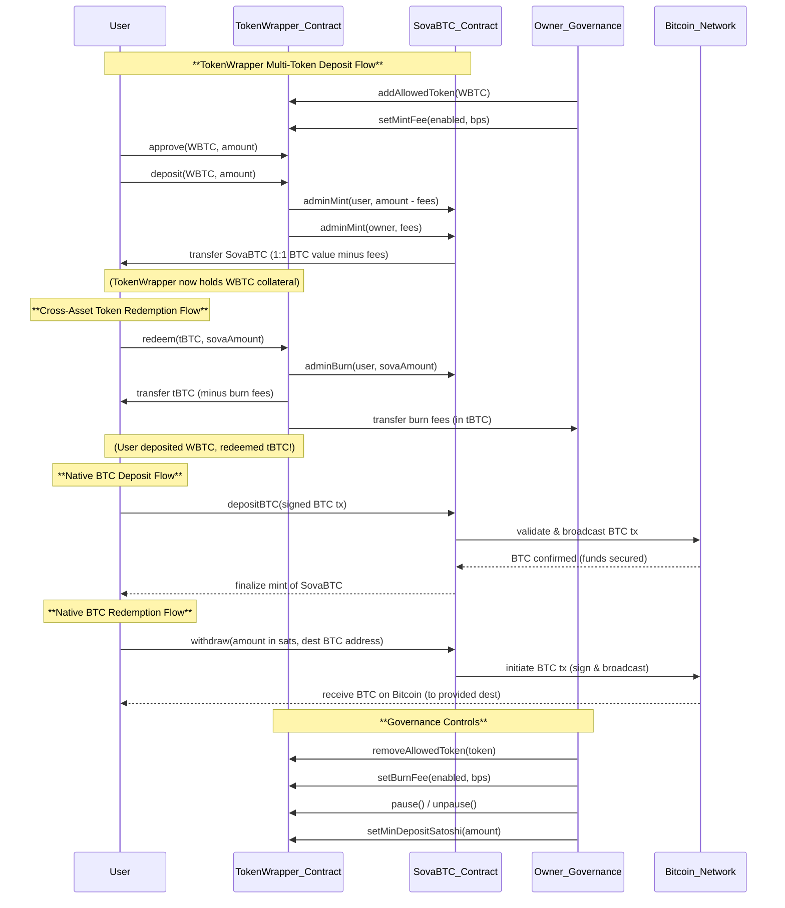

# SovaBTC & TokenWrapper System Flow Diagram

## System Overview

This sequence diagram illustrates the complete SovaBTC ecosystem:

### TokenWrapper Features
1. **Multi-Token Wrapping**: Converts various BTC-pegged tokens (WBTC, tBTC, etc.) into unified SovaBTC
2. **Cross-Asset Conversion**: Deposit one wrapped BTC token, redeem another
3. **Fee System**: Configurable mint/burn fees collected by governance
4. **Governance Controls**: Allowlist management, fee configuration, emergency pause

### Native Bitcoin Integration
1. **Direct BTC Deposits**: Users can deposit native Bitcoin directly to mint SovaBTC
2. **Direct BTC Withdrawals**: Users can redeem SovaBTC for native Bitcoin
3. **Bitcoin Network Validation**: All BTC transactions are validated and broadcast to Bitcoin network

### Key Differentiators
- **Unified liquidity**: All wrapped BTC tokens contribute to a single SovaBTC token
- **1:1 BTC backing**: Every SovaBTC represents exactly 1 Bitcoin worth of value
- **Flexible redemption**: Users can exit into any supported wrapped BTC token or native Bitcoin
- **Revenue generation**: Optional fees provide sustainable funding for the protocol 