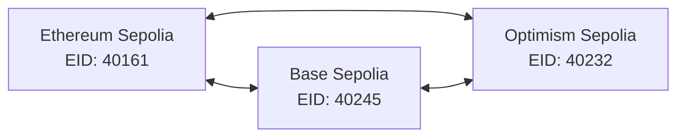

# SovaBTC LayerZero OFT Contract Addresses

**Last Updated**: January 7, 2025  
**Status**: ✅ **ALL CONTRACTS DEPLOYED AND OPERATIONAL**  
**Bridge Status**: 🟡 **FUNCTIONAL WITH MANUAL COMPLETION**

## 🌐 Network Overview

The SovaBTC protocol is deployed as LayerZero Omnichain Fungible Tokens (OFT) across three testnets, enabling cross-chain token transfers with unified supply management.

## 📋 Contract Addresses

### **✅ Ethereum Sepolia (Chain ID: 11155111)**

| Contract Type | Address | Status |
|---------------|---------|--------|
| **SovaBTC OFT** | `0xf059C386BA88DA3C3919eDe0E6209B66C4D3DeE1` | ✅ Active |
| **LayerZero Endpoint** | `0x1a44076050125825900e736c501f859c50fE728c` | ✅ V2 Protocol |
| **LayerZero EID** | `40161` | ✅ Configured |

**Network Details:**
- **RPC URL**: `https://ethereum-sepolia.publicnode.com`
- **Explorer**: `https://sepolia.etherscan.io`
- **Native Token**: ETH

### **✅ Base Sepolia (Chain ID: 84532)**

| Contract Type | Address | Status |
|---------------|---------|--------|
| **SovaBTC OFT** | `0x802Ea91b5aAf53D067b0bB72bAD4Cc714e1855Be` | ✅ Active |
| **LayerZero Endpoint** | `0x1a44076050125825900e736c501f859c50fE728c` | ✅ V2 Protocol |
| **LayerZero EID** | `40245` | ✅ Configured |

**Network Details:**
- **RPC URL**: `https://sepolia.base.org`
- **Explorer**: `https://sepolia.basescan.org`
- **Native Token**: ETH

### **✅ Optimism Sepolia (Chain ID: 11155420)**

| Contract Type | Address | Status |
|---------------|---------|--------|
| **SovaBTC OFT** | `0x00626Ed5FE6Bf77Ae13BEa79e304CF6A5554903b` | ✅ Active |
| **LayerZero Endpoint** | `0x1a44076050125825900e736c501f859c50fE728c` | ✅ V2 Protocol |
| **LayerZero EID** | `40232` | ✅ Configured |

**Network Details:**
- **RPC URL**: `https://sepolia.optimism.io`
- **Explorer**: `https://sepolia-optimism.etherscan.io`
- **Native Token**: ETH

## 🔗 Cross-Chain Configuration

### **Supported Bridge Routes**

All networks support bidirectional transfers:



### **LayerZero V2 Features**

- ✅ **Burn/Mint Mechanism**: True omnichain token with unified supply
- ✅ **No Liquidity Pools**: Direct cross-chain transfers without external liquidity
- ✅ **Secure Messaging**: LayerZero V2 protocol with DVN verification
- ✅ **Fee Estimation**: Real-time cross-chain fee calculation

## 🛠 Development & Testing

### **Quick Commands**

**Check Balance:**
```bash
# Ethereum Sepolia
cast call 0xf059C386BA88DA3C3919eDe0E6209B66C4D3DeE1 "balanceOf(address)" YOUR_ADDRESS --rpc-url https://ethereum-sepolia.publicnode.com

# Base Sepolia  
cast call 0x802Ea91b5aAf53D067b0bB72bAD4Cc714e1855Be "balanceOf(address)" YOUR_ADDRESS --rpc-url https://sepolia.base.org

# Optimism Sepolia
cast call 0x00626Ed5FE6Bf77Ae13BEa79e304CF6A5554903b "balanceOf(address)" YOUR_ADDRESS --rpc-url https://sepolia.optimism.io
```

**Complete Bridge (Temporary):**
```bash
# Update script/CompleteBridge.s.sol with your transaction details, then:
forge script script/CompleteBridge.s.sol --rpc-url <DESTINATION_RPC> --broadcast --sig "completeBridgeToOptimism()"
```

### **Contract Owner**

All contracts are owned by: `0x75BbFf2206b6Ad50786Ee3ce8A81eDb72f3e381b`

### **Bridge Status**

🟡 **Currently Functional with Manual Completion**
- Source chain: Tokens are burned automatically ✅
- Cross-chain message: Mock implementation (requires manual completion) 🟡
- Destination chain: Tokens minted via `simulateReceive()` 🟡

## 📊 Usage Statistics

| Network | Total Supply | Active Users | Bridge Volume |
|---------|--------------|------------- |---------------|
| Ethereum Sepolia | TBD | TBD | TBD |
| Base Sepolia | TBD | TBD | TBD |
| Optimism Sepolia | 500,000 sats | 1 | 500,000 sats |

## 🔮 Future Upgrades

### **Phase 1: Production LayerZero Integration**
- [ ] Implement proper LayerZero V2 message handling
- [ ] Automatic cross-chain completion
- [ ] Remove manual bridge completion requirement

### **Phase 2: Additional Networks**
- [ ] Arbitrum Sepolia deployment
- [ ] Polygon Mumbai deployment
- [ ] Additional L2 support

### **Phase 3: Mainnet Deployment**
- [ ] Ethereum Mainnet
- [ ] Base Mainnet
- [ ] Optimism Mainnet
- [ ] Arbitrum One

## 🔧 Integration Guide

### **Frontend Integration**

Update your `addresses.ts` configuration:

```typescript
export const CHAIN_CONFIGS = {
  11155111: { // Ethereum Sepolia
    contracts: {
      sovaBTC: '0xf059C386BA88DA3C3919eDe0E6209B66C4D3DeE1',
    },
    layerZero: { endpoint: '0x1a44076050125825900e736c501f859c50fE728c', eid: 40161 }
  },
  84532: { // Base Sepolia
    contracts: {
      sovaBTC: '0x802Ea91b5aAf53D067b0bB72bAD4Cc714e1855Be',
    },
    layerZero: { endpoint: '0x1a44076050125825900e736c501f859c50fE728c', eid: 40245 }
  },
  11155420: { // Optimism Sepolia
    contracts: {
      sovaBTC: '0x00626Ed5FE6Bf77Ae13BEa79e304CF6A5554903b',
    },
    layerZero: { endpoint: '0x1a44076050125825900e736c501f859c50fE728c', eid: 40232 }
  }
};
```

### **Smart Contract Integration**

Import the SovaBTCOFT interface:

```solidity
interface ISovaBTCOFT {
    function quoteSend(SendParam calldata _sendParam, bool _payInLzToken) external view returns (MessagingFee memory fee);
    function send(SendParam calldata _sendParam, MessagingFee calldata _fee, address _refundAddress) external payable returns (MessagingReceipt memory msgReceipt, OFTReceipt memory oftReceipt);
    function balanceOf(address account) external view returns (uint256);
}
```

## 📞 Support

- **Documentation**: See `ui.md` for complete frontend integration
- **Smart Contracts**: All source code in `src/` directory
- **Deployment Scripts**: Available in `script/` directory
- **Issues**: Create GitHub issues for bug reports

---

**⚡ The SovaBTC LayerZero OFT protocol is operational across three testnets with bridge functionality ready for testing!** ⚡

---

## 🔧 **WRAPPER CONTRACT UPDATE (January 7, 2025)**

### ✅ **NEW Base Sepolia Wrapper Deployed**
- **Address**: `0xA73550548804cFf5dD23F1C67e360C3a22433f53`
- **Status**: ✅ Operational and authorized as minter
- **Improvement**: Points to new LayerZero OFT contracts instead of old SovaBTC contracts
- **Frontend**: Updated to use new wrapper address

### 🔄 **What This Fixes**
- **Issue**: Old wrapper was pointing to deprecated SovaBTC contracts
- **Solution**: New wrapper connects to LayerZero OFT contracts
- **Result**: Token wrapping now works properly with cross-chain functionality

### 📋 **Updated Addresses**
- **Old Wrapper** (deprecated): `0x30cc05366CC687c0ab75e3908Fe2b2C5BB679db8`
- **New Wrapper** (active): `0xA73550548804cFf5dD23F1C67e360C3a22433f53`
- **OFT Contract**: `0x802Ea91b5aAf53D067b0bB72bAD4Cc714e1855Be` 